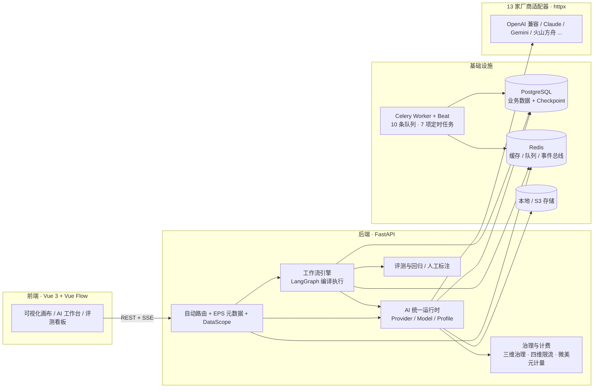

<!-- 目录导航：使用 GitHub 自动锚点 -->

# Loom

### 面向企业的全栈 AI 内容生成 + Agent 工作流平台

> **一个后端，搞定 AI 流程的「接、编、测、管、算」。**

Loom 把 **多厂商模型统一运行时、可视化工作流编排（LangGraph 编译型引擎）、工作流评测回归、企业级治理与计费** 整合到同一套后端。业务方在画布上拼装 AI 流程，通过统一的 Profile 抽象消费多家厂商能力，无需关心底层差异。

[](./LICENSE)


> 🖼️ **界面预览（截图待补充）**
> Loom 的**可视化工作流编辑画布**、**AI 对话测试台**、**工作流实例监控**等界面截图将陆续补充到 `docs/assets/screenshots/`。
> 规划中的截图清单：`workflow-editor.png`（工作流编辑器，Hero 图位）、`ai-chat-console.png`（AI 对话测试台）、`eval-dashboard.png`（评测/回归对比）、`governance-panel.png`（治理与成本看板）、`instance-monitor.png`（实例监控 + 人工审批恢复）。
> 在此之前，可先通过下方「[快速上手](#快速上手)」在本地启动体验完整界面；「[技术栈与架构](#技术栈与架构)」一节的 **Mermaid 架构图**可视为当下的视觉锚点。

## 目录

- [为什么选 Loom](#为什么选-loom)
- [功能亮点](#功能亮点)
- [快速上手](#快速上手)
- [适用场景](#适用场景)
- [核心能力概览](#核心能力概览)
- [框架底座能力](#框架底座能力)
- [技术栈与架构](#技术栈与架构)
- [工作流引擎](#工作流引擎)
- [评测与治理](#评测与治理)
- [示例工作流](#示例工作流)
- [项目结构](#项目结构)
- [文档索引](#文档索引)
- [贡献指南](#贡献指南)
- [路线图](#路线图)
- [开源协议](#开源协议)

---

## 为什么选 Loom

- **不必为每家厂商写一套 SDK 胶水代码。** Provider / Model / Profile 三层配置把 **13 家厂商**收敛到一层适配器，业务只认 `profile_code`，**换厂商不发版**，并支持配置级自动降级（`fallback_profile_id`）。
- **AI 流程是可编译、可回归、可人工介入的，而不是一次性脚本。** 画布拓扑**先校验、再编译**为 LangGraph 图执行；每次改流程都能跑同一测试集做**回归对比**；需要人工确认时可**挂起 / 恢复**。
- **成本与用量能算清、能管住。** 跨厂商成本统一以**微美元（micro-USD）计量**、可归因到具体工作流实例；范围 × 周期 × 模式三维治理 + 请求 / 并发 / Token / 成本四维限流。
- **LLM-as-judge 不止「能用」，还要「可信」。** 独立标注模块提供标注队列与多标注者一致性（Cohen's κ / Fleiss' κ），用 gold set 量化 judge 可信度。

> 与「编排 **或** 运行时 **或** 评测」各占一端的工具不同，Loom 把 **AI 运行时、编译型编排、评测回归、治理计费** 收敛到同一套后端——这也是它面向企业而非单应用场景的原因。

## 功能亮点

**① 多厂商 AI 统一运行时**
Provider / Model / Profile 三层配置 + 13 家厂商适配器，业务只认 `profile_code`，换厂商不发版，支持配置级自动降级。
`Profile 抽象 · fallback`

**② 可视化 Agent 编排（编译型引擎）**
Vue Flow 画布 + **15 种节点类型（其中 13 个为已注册执行器）**，拓扑先校验、再编译为 LangGraph 图执行；支持人工交互挂起 / checkpoint 恢复。
`LangGraph · 15 节点 · 人工挂起`

**③ 工作流评测与回归**
测试集 / 用例 / 评估运行 / 回归对比四类对象，每用例跑真实 `WorkflowInstance` 全链路，规则 + LLM judge 等 **5 类评估器**，按 `case_key` 对齐 diff。
`回归对比 · 真实实例`

**④ 人工标注与 κ 校准**
标注队列 + 多标注者一致性（Cohen's κ / Fleiss' κ），用 gold set 量化 LLM judge 可信度——让 judge 从「能用」到「可信」。
`κ 一致性 · gold set`

**⑤ 企业级治理与安全**
范围 × 周期 × 模式三维治理 + 请求 / 并发 / Token / 成本四维限流 + 提示注入检测 + PII 脱敏 + 密钥加密。
`四维限流 · 注入检测 · 脱敏`

**⑥ 微美元级计费与可观测**
跨厂商成本统一以**微美元**计量、可归因到工作流实例；操作 / 登录 / 安全三类审计日志 + `/health` + `/metrics`。
`微美元计量 · 审计`

## 快速上手

### 方式 A：Docker Compose（一键启动后端栈）

```bash
# 1. 拉取代码
git clone https://github.com/12345VVA/Loom.git
cd Loom

# 2. 准备环境变量（两份都要）
cp .env.example .env
cp backend/.env.example backend/.env   # 必做：Celery worker 依赖 backend/.env

# 3. 编辑 backend/.env，至少配置 DATABASE_URL / REDIS_URL / JWT_SECRET_KEY 等必填项
#    （在 docker compose 场景中，PG / Redis 连接已由 compose 注入，通常无需修改）

# 4. 启动
docker compose up -d
```

> ⚠️ 根 `.env.example` 仅含少量变量（OpenAI 凭证等）；**后端必填项（`DATABASE_URL`、`REDIS_URL`、`JWT_SECRET_KEY`、`HOST` 等）只在 `backend/.env.example` 中**，务必拷贝后填写。

启动后访问：

- 后端 API：<http://localhost:8000>
- API 文档：<http://localhost:8000/docs>
- Redoc：<http://localhost:8000/redoc>

### 方式 B：前端本地开发（推荐）

> 根 `docker-compose.yml` 中的 `frontend` 服务当前映射 `5173:5173`，与 Vite 默认端口 **9090** 不一致，容器化前端按现配置无法正常访问。**推荐直接本地启动前端**；如需容器化前端，请将端口映射改为 `9090:9090`。

```bash
cd frontend
npm install
npm run dev      # 默认端口 9090
```

访问 <http://localhost:9090>。

### 方式 C：后端本地开发（可选）

```bash
cd backend
python -m venv venv
source venv/bin/activate          # Windows: venv\Scripts\activate
pip install -r requirements.txt
cp .env.example .env              # 编辑 DATABASE_URL / REDIS_URL / JWT_SECRET_KEY 等
uvicorn main:app --reload
```

Celery Worker 与 Beat（新终端）：

```bash
# Worker：全量消费队列
celery -A app.celery_app worker --loglevel=info \
  -Q celery,default,workflow,ai.chat,ai.image,ai.embedding,ai.rerank,ai.audio,ai.video

# Beat：定时任务调度
celery -A app.celery_app beat --loglevel=info
```

### 关键环境变量

完整模板见 **`backend/.env.example`**（根 `.env.example` 不完整）。关键项：

| 分组 | 变量 |
|------|------|
| 基础 | `APP_NAME` `APP_VERSION` `DEBUG` `HOST` `PORT` |
| 数据库 | `DATABASE_URL` `SQL_HOST/SQL_PORT/SQL_DATABASE/SQL_USER/SQL_PASSWORD` |
| Redis / 队列 | `REDIS_URL` `CELERY_BROKER_URL` `CELERY_RESULT_BACKEND` |
| 认证 | `JWT_SECRET_KEY` `JWT_ALGORITHM` `ACCESS_TOKEN_EXPIRE_MINUTES` `REFRESH_TOKEN_EXPIRE_DAYS` |
| 模型凭证 | `OPENAI_API_KEY` `OPENAI_BASE_URL` |
| 存储 | `STORAGE_PROVIDER` `S3_*` |
| 框架 | `RESPONSE_ENVELOPE_MAX_BYTES` `MODULE_LOAD_STRICT` `METRICS_ENABLED` `API_VERSION_PREFIX_ENABLED` |
| 工作流 | `WORKFLOW_CHECKPOINT_BACKEND`（取值 `memory` / `postgres`，**默认 `postgres`**） |

## 适用场景

1. **企业级多厂商 AI 统一接入**：集中管理多家厂商凭证与模型，业务方通过 Profile 调用，**换厂商不发版**。
2. **可视化 Agent 编排**：在画布上拼装含 LLM、工具调用、条件分支、循环、批处理的 Agent 流程，支持人工审批挂起 / 恢复。
3. **工作流回归评测与人工对齐**：流程每次改动跑同一测试集，用规则 + LLM 打分 + κ 校准保证「越改越稳」。
4. **AI 成本治理与审计**：以微美元统一计量跨厂商成本，按范围 / 周期设限流配额，操作 / 登录 / 安全三类审计留痕。
5. **内容生产流水线**：仓库内置真实业务工作流样例（如小红书绘本流水线），可作为内容生产场景的起点参考。
6. **定时化的 AI 任务**：借通用任务调度器给工作流定义定时触发、定时数据加工与清理。

## 核心能力概览

| 业务域 | 能力概述 |
|--------|----------|
| **AI 模型管理** | Provider / Model / Profile 三层配置 + 13 家厂商适配器 + 6 种 AI 能力（chat / embedding / image / audio / video / rerank），密钥集中加密，Profile 对业务屏蔽厂商差异。 |
| **可视化工作流编排** | LangGraph 编译型引擎 + Vue Flow 画布 + 15 种节点类型（13 个已注册执行器）+ 人工交互挂起 / 恢复 + Redis pub/sub 事件总线与 SSE 实时推送。 |
| **工作流评测与回归** | 测试集 / 用例 / 评估运行 / 回归对比四类对象，每用例跑真实 `WorkflowInstance` 全链路，5 类评估器 + κ 校准。 |
| **人工标注** | 独立 `workflow_annotation` 模块，标注队列 + Cohen's / Fleiss' κ 一致性校准，量化 LLM judge 可信度。 |
| **企业级治理与安全** | 三维治理（范围 × 周期 × 模式）+ 四维限流（请求 / 并发 / Token / 成本）+ 提示注入检测 + PII 脱敏 + 会话并发控制。 |
| **可观测与计费** | 调用日志以微美元计量成本；用量看板 + 操作 / 登录 / 安全三类审计日志 + `/health` + `/metrics`。 |
| **通用定时任务调度** | `task` 模块作为通用系统调度器：cron / 间隔触发 + Celery Beat 扫描 + 反射执行，与业务解耦。 |
| **通知系统** | 站内 / 业务 / 任务通知 + 模板化发送。 |
| **媒体 / 字典 / 权限** | 本地与 S3 兼容文件存储、字典枚举管理、基于 JWT + 动态菜单的细粒度权限与数据权限。 |

## 框架底座能力

- **模块化架构**：模块自治，独立中间件、白名单、数据初始化与菜单注入 —— [框架说明文档](./docs/框架说明文档.md)
- **自动路由**：按 `controller/{scope}/` 约定注册，URL 遵循 `/{scope}/{module}/{resource}/{action}` —— [模块自动路由与管理端鉴权说明](./docs/模块自动路由与管理端鉴权说明.md)
- **声明式 CRUD 控制器**：`@CoolController` 自动注册 add / delete / update / info / list / page —— [框架 Controller 使用规范](./docs/框架Controller使用规范.md)
- **EPS 元数据**：自动导出模型字段与校验规则，驱动前端表单 / 表格 / 校验 —— [EPS规范原理与操作指南](./docs/EPS规范原理与操作指南.md)
- **数据权限**：`DataScope` 查询期自动注入（全部 / 本人 / 本部门 / 本部门及下属 / 自定义）—— [权限管理与登录模块设计](./docs/权限管理与登录模块设计.md)
- **软删除**：含 `delete_time` 的模型自动过滤已删除记录 —— [框架说明文档](./docs/框架说明文档.md)
- **字段映射**：`snake_case` ↔ `camelCase` 自动转换 —— [字段映射使用规范](./docs/字段映射使用规范.md)
- **缓存命名空间与降级**：Redis 命名空间隔离，开发环境自动降级为进程内缓存 —— [框架说明文档](./docs/框架说明文档.md)

## 技术栈与架构

**前端**：Vue 3 + TypeScript + Vite（开发端口 9090）、Pinia、Vue Router、Axios、Element Plus + `@cool-vue/crud`、**Vue Flow**（`@vue-flow/core`）。

**后端**：FastAPI、SQLModel + SQLAlchemy 2.0 + Alembic、**Celery** + **Celery Beat**、**Redis**（缓存 / 队列 / 事件总线）、**LangGraph**（工作流编译与执行）。

**AI 与编排**：**仅依赖 OpenAI SDK**；Claude / Gemini / 火山方舟等厂商均由**自研 httpx 适配器**实现（未引入 Anthropic / Google GenAI / Volcengine 官方 SDK）；自研 `SafeEvaluator`（AST 白名单安全求值）。

**基础设施**：PostgreSQL、Redis、Docker & Docker Compose、本地 / S3-compatible 文件存储。



## 工作流引擎

工作流引擎以 **LangGraph** 为执行内核：前端画布拓扑**先经拓扑校验、再编译**为 StateGraph，运行期是编译后的图，比解释执行更可靠。完整设计见 [AI 与工作流系统架构说明](./docs/AI与工作流系统架构说明.md)。

### 编译链路

```text
validate_graph(拓扑校验) → 递归编译子图(loop / batch) → 主图 add_node → add_edge → 条件分流 add_conditional_edges
```

`validate_graph` 前置校验：缺 START 节点、悬空 / 重复边、子图路由、孤立节点、静态环路检测（DFS）、模型节点配置完整性。条件分流节点（`condition` / `intent_classifier` / `switch`）的出边由运行时路由决定，不参与静态环检测；循环 / 批处理节点在编译期提取为独立子图。

### 节点类型（15 种，其中 13 个为已注册执行器）

> 节点执行器通过 `NodeExecutorRegistry` 注册（`(state, config) -> dict`），可扩展。`start` 与 `loop_body_group` **不注册执行器**，由编译器特殊处理。

| # | 节点 type | 执行器 | 说明 |
|---|-----------|--------|------|
| 1 | `start` | ❌ 编译器特殊处理 | 流程起点（映射为 LangGraph `START`） |
| 2 | `end` | ✅ | 流程终点 |
| 3 | `llm` | ✅ | 分层 JSON 输出（Tier1 `json_schema` / Tier2 `json_object` / Tier3 纯文本） |
| 4 | `image_generator` | ✅ | 生图 + 转存媒体库 |
| 5 | `intent_classifier` | ✅ | 意图路由 |
| 6 | `tool_executor` | ✅ | 工具调用编排（内置工具为占位实现） |
| 7 | `condition` | ✅ | T/F 双端口条件分流 |
| 8 | `switch` | ✅ | 动态端口分支 |
| 9 | `loop_controller` | ✅ | 状态链式循环 |
| 10 | `batch_processor` | ✅ | `asyncio.gather` + `Semaphore`，并发上限 1–20 |
| 11 | `human_input` | ✅ | LangGraph `interrupt` 挂起 |
| 12 | `variable_assignment` | ✅ | 变量赋值 |
| 13 | `variable_transform` | ✅ | 数据转换 |
| 14 | `tool` | ✅（**已废弃**） | 旧版兼容节点，生产环境直接失败 |
| 15 | `loop_body_group` | ❌ 编译器特殊处理 | 循环体容器（纯视觉容器） |

### Checkpoint 持久化

`checkpointer.py` 支持**两档后端**，由 `WORKFLOW_CHECKPOINT_BACKEND` 配置（**默认 `postgres`**；未知取值直接抛 `ValueError`，不做静默降级）：

| 后端 | 适用场景 |
|------|----------|
| `memory` | 进程内，**仅测试 / 临时**；与 Celery worker 跨进程互不相通，人工挂起 / 恢复不可用 |
| `postgres` | **默认**，生产多 worker 共享，paused 实例可恢复 |

Checkpoint 是人工交互挂起 / 恢复的基础——`human_input` 节点 `interrupt` 后状态落入持久化后端，恢复时从 checkpoint 还原并注入外部输入继续执行。

### 事件总线与 SSE

`event_bus.py` 用 Redis pub/sub 跨进程推送节点执行事件；实例控制器 `/admin/workflow/instance/stream` 以 SSE 实时下发到前端，使试运行 / 实例监控能看到节点级实时进度。

### 健壮性设计

- **原子 CAS 状态机**：`resume` / `cancel` 用 `UPDATE ... WHERE status=?` 消除 TOCTOU 竞态。
- **防重放**：启动 2 秒去重、单节点测试 Redis 去重（429）。
- **稳定 Handle ID**：前端 `genId()` + 后端 `case_${stableId}`，解决删除中间分支导致连线错位。
- **数据权限**：`assert_workflow_owner` 限定非超管只能操作本人工作流。

## 评测与治理

### 评测系统

Loom 内置面向工作流的回归评测 harness：围绕「同一测试集 × 不同图版本，跑真实实例 + 规则 / LLM 打分 + 按 `case_key` 对齐 diff」组织。详细对标分析见 [评测系统对标分析-2026-06-26](./docs/评测系统对标分析-2026-06-26.md)。

**四类业务对象**：测试集 `WorkflowTestSet`、测试用例 `WorkflowTestCase`、评估运行 `WorkflowEvalRun`、回归对比（多版本 `WorkflowEvalRun` 按 `case_key` 对齐）。

**5 个评估器**：

| 评估器 | 说明 |
|--------|------|
| `rule_match` | 规则匹配，支持 `exact` / `contains` / `regex` / `numeric_tolerance` 四种模式 |
| `llm_judge` | 单次 pointwise 0–1 打分 |
| `composite` | 多评估器加权组合 |
| `json_schema` | JSON Schema 结构校验 |
| `safety` | 安全性检查 |

设计亮点：**`graph_json_snapshot` 图快照**（每次运行记录当时拓扑，历史回归可比）；**真实 `WorkflowInstance` 全链路执行**（测到节点 / governance / 事件总线真实行为）；**contextvar 精确 token / cost 关联**。评估运行状态变更走 CAS 状态机，后台 sweep 巡检超时实例，单用例失败不阻断整批。

**人工标注与 κ 校准**：独立 `workflow_annotation` 模块提供标注队列与多标注者一致性校准（Cohen's κ / Fleiss' κ），用 gold set 测 LLM judge 与人工标注的一致性，把 κ 作为 judge 可信度指标。

### 企业级治理与安全

**治理三维**：范围（`global` / `user` / `profile`）× 周期（`minute` / `day` / `month`）× 模式（`enforce` 拦截 / `observe` 观察）。

**四维限流**：请求 / 并发 / Token / 成本四维均可配额，超限触发告警事件（`AiGovernanceEvent`），由 `governance_service.py` 在每次调用前后强制检查。

**安全能力（诚实说明）**：

- **提示注入检测** + 输入侧 DoS 防护（长度上限）。
- **PII 脱敏**：输出侧对手机 / 身份证 / 邮箱自动脱敏（工作流内部数据可 `skip_masking=True` 跳过）。
- **密钥加密**：厂商 API Key 使用 PBKDF2 + 加密存储，前端只回显脱敏串。
- **会话并发控制**：`ADMIN_SESSION_MAX_CONCURRENT` 限制同一用户最大并发会话。
- **CSRF Origin 校验**：`ADMIN_CSRF_ORIGIN_CHECK_ENABLED` 控制管理端变更请求校验。
- **密码哈希升级**：`PASSWORD_PBKDF2_ITERATIONS` 配置迭代次数，登录成功后自动升级旧哈希。

### 可观测与计费

每次 AI 调用记录到 `AiModelCallLog`（延迟、Token、成本字段）。**成本统一以微美元 `cost_micro_usd` 计量**（1 USD = 1,000,000 micro-USD），跨厂商可比；用量看板接口按天 / 维度聚合。审计含 **操作 / 登录 / 安全** 三类日志。`/health` 返回数据库、Redis、Celery 配置检查；`/metrics` 文本指标端点由 `METRICS_ENABLED` 控制（默认关闭）。

### Celery 队列与定时任务

**共定义 10 条队列**：`celery`、`default`、`workflow`、`workflow.eval`、`ai.chat`、`ai.image`、`ai.embedding`、`ai.rerank`、`ai.audio`、`ai.video`。开发 `docker compose` 的 Worker 消费其中 **9 条**（缺 `workflow.eval`），生产 compose 消费 **全部 10 条**。

**Beat 共 7 项定时任务**：

| 调度条目 | 任务名 | 周期 |
|----------|--------|------|
| `dispatch-due-system-tasks` | `task.dispatch_due_tasks` | 每 60 秒 |
| `clean-expired-logs-daily` | `task.clean_expired_logs` | 每天 02:00 |
| `clean-expired-ai-governance-data-daily` | `ai.clean_expired_governance_data` | 每天 03:00 |
| `sweep-timed-out-eval-runs` | `workflow.eval.sweep_timeouts` | 每 900 秒 |
| `sweep-stuck-workflow-instances` | `workflow.cleanup.sweep_stuck_instances` | 每 900 秒 |
| `sweep-archived-versions` | `workflow.version.sweep_archived` | 每天 04:00 |
| `sweep-workflow-cleanup-daily` | `workflow.cleanup.sweep` | 每天 04:30 |

### AI 模型统一运行时

AI 模块以 `AiModelRuntimeService` 为核心，对外暴露统一调用入口，对内通过工厂模式适配 **13 家厂商**。三层配置：`AiProvider`（凭证 + base_url，含 `adapter` / `api_key_cipher` / `api_key_mask` / `extra_config`，以及火山方舟 **AK/SK** 字段 `admin_access_key_cipher` / `admin_secret_key_cipher` / `admin_access_key_mask`）、`AiModel`（能力与定价）、`AiModelProfile`（业务调用参数 + `fallback_profile_id` + `is_default`）。

**厂商适配器清单（13 家）**：`openai-compatible`、`ollama`、`gemini`、`claude`、`deepseek`、`volcengine-ark`（火山方舟）、`bailian`（阿里百炼）、`hunyuan`（腾讯混元）、`qianfan`（百度千帆）、`zhipu`（智谱）、`minimax`、`mimo`（小米 MiMo，**默认 base_url 为空，需手动配置**）、`toapis`（第三方聚合网关）。

适配器基类统一 `chat / stream_chat / embedding / image / audio / video / rerank / test / list_models` 接口。**AI 能力状态**：chat、image、embedding、rerank 已有真实适配器实现；**`ai.audio` / `ai.video` 的接口与队列已定义，但暂无适配器实现**（所有适配器对应方法均抛 `UnsupportedCapabilityError`），已在路线图规划中。

## 示例工作流

`examples/workflows/` 下提供 **13 个**可导入的工作流样例（`01`–`13`），可直接在工作流编辑器导入体验。代表性示例：

- [基础文本生成测试流](./examples/workflows/01_Basic_QA_Workflow.json)（01）：最简 LLM 单节点范例，演示 `start → llm → end`。
- [智能体工具协同流](./examples/workflows/03_Agent_Tool_Workflow.json)（03）：演示 `tool_executor` 的工具调用编排（**内置工具为占位实现，接入真实工具需自行实现**）。
- [故事绘本生成流](./examples/workflows/10_Story_Illustration_Workflow.json)（10）：LLM 生成故事 + 生图节点的内容生产示例。
- [小红书绘本内容流水线（图片数量可配）](./examples/workflows/13_XHS_PictureBook_Pipeline_Parametric.json)（13）：参数化的真实业务内容流水线。

其余示例覆盖意图路由、循环 / 批处理、条件分支、变量操作等场景。

## 项目结构

```text
Loom/
├── frontend/                      # Vue 3 前端
│   ├── src/
│   │   ├── cool/                  # 框架核心、service、router、bootstrap
│   │   ├── modules/               # 业务模块（9 个，见下）
│   │   ├── plugins/               # 项目插件
│   │   └── config/                # 环境与代理配置
│   ├── packages/                  # 本地源码包（@cool-vue/crud 等）
│   └── tests/                     # Vitest 单元测试与 Playwright E2E
├── backend/                       # FastAPI 后端
│   ├── app/
│   │   ├── core/                  # 配置、数据库、安全、Redis、日志
│   │   ├── framework/             # 自动路由、EPS、中间件、查询构建
│   │   └── modules/               # 业务模块（9 个，见下表）
│   ├── tests/                     # pytest 自动化测试
│   └── alembic/                   # 数据库迁移骨架
├── docs/                          # 项目文档（见文末索引）
├── examples/workflows/            # 13 个示例工作流 JSON
├── scripts/                       # 本地验证脚本
├── docker-compose.yml
└── README.md
```

**后端业务模块（`backend/app/modules/`，共 9 个）**

| 模块 | 职责 |
|------|------|
| `ai` | 厂商 / 模型 / Profile 配置管理、13 家厂商适配、统一运行时、治理安全、计费可观测 |
| `base` | 权限 / 认证 / 菜单 / 部门 / 角色等基础能力 |
| `dict` | 字典枚举管理 |
| `media` | 媒体资源与本地 / S3-compatible 文件存储 |
| `notification` | 站内 / 业务 / 任务通知与模板 |
| `task` | 通用系统定时任务调度器（cron / 间隔 + Beat 扫描 + 反射执行） |
| `workflow` | 基于 LangGraph 的编译型工作流引擎 |
| `workflow_annotation` | 人工标注队列与 κ 校准 |
| `workflow_eval` | 工作流评测与回归对比 |

**前端业务模块（`frontend/src/modules/`，共 9 个）**

`ai`、`base`、`dict`、`media`、`notification`、`task`、`workflow`、`workflow_annotation`、`workflow_eval`。其中 AI 模块含对话测试台（SSE 流式）、生图工作台、厂商 / 模型 / 配置管理、治理规则 / 事件、看板、日志、异步任务等页面；工作流模块含 Vue Flow 编辑器、节点配置面板、试运行 / 单节点测试 / 实时日志抽屉、实例管理（含人工审批恢复）。

## 文档索引

完整文档索引见 [docs/README.md](./docs/README.md)，关键文档包括：

- [AI 与工作流系统架构说明](./docs/AI与工作流系统架构说明.md)：AI 模块、工作流模块、task 模块的完整架构与集成关系。
- [评测系统对标分析-2026-06-26](./docs/评测系统对标分析-2026-06-26.md)：工作流评测系统能力边界与提升路线图。
- [框架说明文档](./docs/框架说明文档.md)：模块化、自动路由、EPS、DataScope 等核心机制。
- [模块自动路由与管理端鉴权说明](./docs/模块自动路由与管理端鉴权说明.md)：路由约定与权限校验。
- [EPS规范原理与操作指南](./docs/EPS规范原理与操作指南.md)：EPS 元数据协议。
- [字段映射使用规范](./docs/字段映射使用规范.md)：snake_case ↔ camelCase 字段映射。
- [框架 Controller 使用规范](./docs/框架Controller使用规范.md) / [框架 Service 使用规范](./docs/框架Service使用规范.md) / [框架 Model 使用规范](./docs/框架Model使用规范.md)：CRUD 与建模规范。
- [权限管理与登录模块设计](./docs/权限管理与登录模块设计.md)：JWT、动态菜单、数据权限。
- [通知系统框架说明](./docs/通知系统框架说明.md)：通知与模板。
- [自动化测试使用说明](./docs/自动化测试使用说明.md)：pytest / 单元测试 / E2E。

项目启动后还可访问实时 API 文档：<http://localhost:8000/docs>、<http://localhost:8000/redoc>。

## 贡献指南

> 仓库暂无独立 `CONTRIBUTING.md`；开发口径以 [`AGENTS.md`](./AGENTS.md) 为准，**修改前请先阅读**：根目录 `AGENTS.md` 与 `CLAUDE.md`、`frontend/.cursor/rules/*.mdc`、`backend/.cursor/rules/*.mdc`。

1. **启动开发环境**：`docker compose up -d` 一键起后端栈；或按上文「快速上手」分别本地启动前端（9090）与后端（8000）。
2. **提交信息遵循 [Conventional Commits](https://www.conventionalcommits.org/)**；变更日志由 [git-cliff](https://git-cliff.org/) 依据仓库根 [`cliff.toml`](./cliff.toml) 生成。
3. **提交前自检**：
   - 前端：`cd frontend && npm run type-check && npm run lint:check && npm run test:unit`
   - 后端：`cd backend && python -m pytest`
4. **PR 规范**：一个 PR 聚焦一件事，附验证方式；**不提交密钥与 `.env` 文件**。

## 路线图

以下为**规划中**（Roadmap）项，不做时间承诺：

- **音视频适配器补全**：`ai.audio` / `ai.video` 接口与队列已定义，补全各厂商适配器实现。
- **工具生态**：`tool_executor` 内置工具（web search / file system 等）由占位实现升级为可插拔真实工具。
- **更多厂商接入**：持续扩展厂商适配器清单。
- **界面截图与文档补全**：补齐 `docs/assets/screenshots/` 下的界面截图与使用示例。

## 开源协议

本项目采用 [MIT License](./LICENSE) 协议开源。
