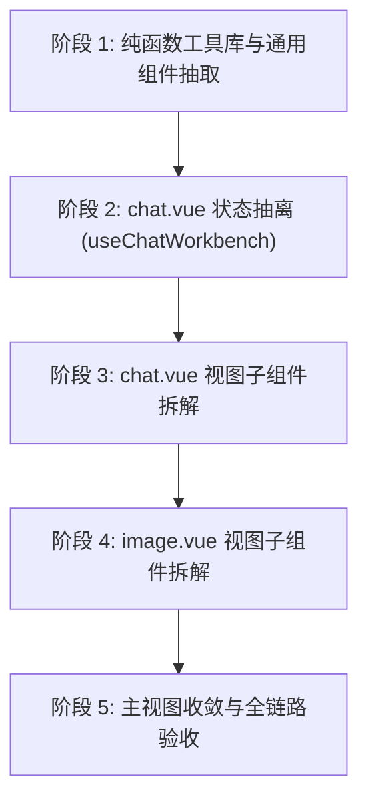

# Loom AI 工作台重构方案：Chat & Image 双页面规范化拆解

> **状态**：待评审 / 计划实施  
> **涉及范围**：`frontend/src/modules/ai/`  
> **基准规范**：`AGENTS.md`、`frontend/.cursor/rules/module.mdc`、`frontend/.cursor/rules/ui-guidelines.mdc`  
> **目标**：彻底消灭 `image.vue`（1,836 行）和 `chat.vue`（1,451 行）两大巨型文件债务，将主视图缩减至 150~200 行，建立清晰的 Composable + 子组件化架构。

> ⏳ **状态标记（2026-10-05 补）**：**方案类文档，未见对应的实施/验收报告**（2026-10-05 归档盘点结论）。是否已落地**尚未核实**——如需推进，请先对照当前 `frontend/src/modules/ai/` 现状确认。索引状态见 [docs/README.md](./README.md) §8。

---

## 一、 现状与问题总结

| 指标 | `image.vue` (生图工作台) | `chat.vue` (对话工作台) | 合计 / 影响 |
| :--- | :--- | :--- | :--- |
| **总行数** | **1,836 行** | **1,451 行** | **3,287 行** (占 ai 模块前端代码量大半) |
| **样式 SCSS** | 937 行 (51%) | 699 行 (48%) | 1,636 行样式裸写在单个视图的 scoped 块中 |
| **模板 DOM** | 598 行 (32%) | 338 行 (23%) | 承载过多子视图（骨架屏、气泡、调试器、弹窗） |
| **脚本逻辑** | 298 行 (17%)，已抽 composable | 411 行 (29%)，**完全未抽 composable** | 状态流、SSE 流管理与 DOM 强绑定，不可单测 |
| **架构违背** | 违背 `module.mdc` 容器与视图规范 | 违背 `module.mdc`，且违背单一职责原则 | 维护难度极高，难以扩展新功能（如联网检索/代码块高亮） |

---

## 二、 目标架构蓝图

遵循 Loom 框架的 `module.mdc` 规范，重构后的目录演进为：

```
frontend/src/modules/ai/
├── components/
│   ├── image-provider-params.vue         # [已有] 厂商专属参数表单
│   ├── image-generator-panel.vue         # [新增] 生图左侧：调用配置、Prompt、参考图与生图参数
│   ├── image-gallery.vue                 # [新增] 生图右侧：画廊展示容器、骨架屏加载、空状态
│   │   └── image-gallery-card.vue        # [新增] 单张图片渲染与悬浮操作（下载/全屏/复制/设参考图）
│   ├── chat-message-bubble.vue           # [新增] 对话气泡：头像、Markdown净化渲染、打字动效、操作项
│   ├── chat-composer.vue                 # [新增] 对话底部：多行输入、快捷键发送、流式/普通切换
│   ├── chat-params-popover.vue           # [新增] 对话推理参数 Popover（Temperature/Tokens/SystemPrompt）
│   ├── ai-stream-drawer.vue              # [新增/通用] SSE 实时事件流与分块审计抽屉 (可服务多工作台)
│   └── ai-payload-inspector.vue          # [新增/通用] 请求/响应报文 Inspector 折叠审计器
├── composables/
│   ├── use-image-workbench.ts            # [已有] 生图工作台响应式状态与调度
│   └── use-chat-workbench.ts             # [新增] 对话工作台响应式状态、SSE流处理与历史消息管理
├── utils/
│   ├── image-providers.ts                # [已有] 模型枚举与预置常量
│   ├── ratio-helper.ts                   # [新增] 尺寸、比例与宽高比容差匹配纯算法 (带单测)
│   └── markdown-renderer.ts              # [新增] marked + DOMPurify 安全富文本渲染封装
└── views/
    ├── chat.vue                          # [瘦身] 纯布局容器 (~150 行)
    └── image.vue                         # [瘦身] 纯布局容器 (~180 行)
```

---

## 三、 重构实施方案（分五个低风险阶段）



### 阶段一：纯函数工具库与模块通用组件抽取（零破坏性基础）
- **1.1 提取比例算法 `utils/ratio-helper.ts`**：
  - 抽取常量 `COMMON_RATIOS`；
  - 抽取纯计算函数 `isRatioActive(currentSize, ratioKey)`、`selectRatioOption(options, ratioKey)`；
  - 在 `frontend/tests/unit/ai/ratio-helper.test.ts` 中补充单元测试覆盖各长宽比例换算与近似匹配。
- **1.2 提取富文本解析 `utils/markdown-renderer.ts`**：
  - 封装 `marked` 配置（`gfm: true, breaks: true`）与 `DOMPurify.sanitize()`；
  - 导出单例解析方法 `renderMarkdown(content: string): string`，防 XSS 注入并统一维护。
- **1.3 提取通用流审计抽屉 `components/ai-stream-drawer.vue`**：
  - 将 `chat.vue` 右侧 120 行 SSE 抽屉模板及 150 行样式提取为独立组件；
  - 属性接口（Props）：`modelValue` (可见性), `events` (事件列表), `status` (当前状态), `statusType`；
  - 事件接口（Emits）：`clear`, `copy`, `update:modelValue`。
- **1.4 提取通用报文审计器 `components/ai-payload-inspector.vue`**：
  - 将 `image.vue` 底部的折叠报文审查器提炼为通用组件；
  - 属性接口（Props）：`result` (响应实体), `lastPayload` (请求载荷), `defaultOpen` (默认展开)。

---

### 阶段二：`chat.vue` 核心逻辑下沉（建立 `useChatWorkbench`）
- **2.1 新建 `composables/use-chat-workbench.ts`**：
  - 将原 411 行脚本中的以下状态与生命周期完整接管：
    - 状态源：`profileOptions`, `messages`, `streamEvents`, `streamStatus`, `loading`, `form`, `isBusy`；
    - 行为动作：
      - `initProfiles()`：拉取支持 chat 的 Profile 列表；
      - `sendChat()`：普通同步请求调用；
      - `sendStream()`：基于 `useStream()` 的 SSE 流式打字与增量 chunk 拼接；
      - `stopStream()`：中断 SSE 请求；
      - `regenerateFrom(id)`：截断上下文并重发；
      - `removeMessage(id)`、`clearMessages()`、`clearStreamLogs()`；
  - 暴露响应式对象与方法给组件消费。

---

### 阶段三：`chat.vue` 视图子组件拆解与收敛
- **3.1 拆解 `components/chat-message-bubble.vue`**（约 120 行）：
  - 渲染单条对话气泡（用户纯文本 vs 助手 Markdown）；
  - 打字机光标（`typing-cursor`）动效与操作按钮（复制/重试/删除）；
  - Props：`message`, `isStreaming`；Emits：`regenerate`, `remove`。
- **3.2 拆解 `components/chat-composer.vue`**（约 90 行）：
  - 底部文本域、自适应高度、`Enter` 发送 / `Shift+Enter` 换行快捷键、发送/停止生成主按钮；
  - Props：`modelValue` (prompt), `isBusy`, `isStreaming`, `loading`；Emits：`send`, `send-stream`, `stop`。
- **3.3 拆解 `components/chat-params-popover.vue`**（约 70 行）：
  - 承载 Temperature 滑块、MaxTokens 计数器、SystemPrompt 文本域与携带上下文开关。
- **3.4 收敛 `views/chat.vue`**：
  - 主文件仅负责组装 Header、`chat-message-bubble` 列表、`chat-composer` 与 `ai-stream-drawer`；
  - 主文件样式精简至约 50 行（整体两栏 Flex 布局与滚动条穿透）。
  - **行数由 1,451 行下降到约 130~150 行**。

---

### 阶段四：`image.vue` 视图子组件拆解与收敛
- **4.1 拆解 `components/image-gallery-card.vue`**（约 80 行）：
  - 单张图片容器、`el-image` 占位/失败插槽、悬浮磨砂操作栏（全屏/下载/复制/转底图/外链）；
  - Props：`item`, `index`, `size`, `previewList`；Emits：`use-reference`, `download`。
- **4.2 拆解 `components/image-gallery.vue`**（约 160 行）：
  - 整合异步任务已提交状态（`el-result`）、生成中骨架屏脉冲动画、卡片列表与空状态；
  - 吸收原 440 行画廊相关 SCSS。
- **4.3 拆解 `components/image-generator-panel.vue`**（约 220 行）：
  - 整合调用配置、Prompt 文本框与字数计数器、参考图上传/URL 切换、尺寸比例胶囊、双列表单、高级 JSON 折叠；
  - 挂载 `image-provider-params.vue`；
  - 吸收原 470 行配置面板 SCSS。
- **4.4 收敛 `views/image.vue`**：
  - 主文件仅保留 `generator-panel`、`gallery` 和 `payload-inspector` 的 Grid 挂载；
  - **行数由 1,836 行下降到约 160~180 行**。

---

### 阶段五：样式治理与全链路回归验证
- **5.1 样式彻底隔离**：
  - 所有拆分出去的 SCSS 严格封装在各子组件的 `<style lang="scss" scoped>` 中；
  - 消除冗余的动画声明与颜色硬编码，统一对齐 Element Plus 变量体系。
- **5.2 规范与工程验证**：
  1. 静态类型检查：在 `frontend/` 下运行 `npm run type-check`，确保 **0 TS 错误**；
  2. 单元测试回归：在 `frontend/` 下运行 `npm run test:unit`，新增的 `ratio-helper.test.ts` 100% 通过；
  3. 业务全链路走查：
     - [ ] **对话工作台**：切换 Profile $\rightarrow$ 调整推理参数 $\rightarrow$ 普通发送 $\rightarrow$ 流式发送与实时打字 $\rightarrow$ 中断流输出 $\rightarrow$ SSE 抽屉日志查看与复制；
     - [ ] **生图工作台**：切换 Profile $\rightarrow$ 点击 16:9 / 1:1 胶囊自动选尺寸 $\rightarrow$ 填入提示词 $\rightarrow$ 点击立即生成展示骨架屏 $\rightarrow$ 画廊卡片悬浮下载与设为参考图 $\rightarrow$ 底部报文展开复制。

---

## 四、 职责矩阵与收益预估

| 模块单元 | 重构前行数 | 重构后行数 | 承担核心职责 |
| :--- | :---: | :---: | :--- |
| `views/image.vue` | 1,836 | **~180** | 生图工作台路由入口与顶层双栏布局容器 |
| `components/image-generator-panel.vue` | - | ~220 | 生图参数配置、Prompt 输入与参考图底图管理 |
| `components/image-gallery.vue` | - | ~160 | 生图结果画廊展示、骨架屏状态、空状态 |
| `components/image-gallery-card.vue` | - | ~80 | 单张图片的悬浮操作交互（下载/预览/复制等） |
| `views/chat.vue` | 1,451 | **~140** | 对话工作台路由入口与消息滚动流容器 |
| `composables/use-chat-workbench.ts` | - | ~260 | 对话状态管理、消息增删改查、SSE 实时流打字编排 |
| `components/chat-message-bubble.vue` | - | ~120 | 消息气泡渲染、Markdown 净化输出、光标动效 |
| `components/chat-composer.vue` | - | ~90 | 输入区域、键盘事件响应、流式/普通发送切换 |
| `components/chat-params-popover.vue` | - | ~70 | Temperature/Tokens 等推理参数配置浮窗 |
| `components/ai-stream-drawer.vue` | - | ~120 | 模块通用 SSE 事件流调试抽屉 |
| `components/ai-payload-inspector.vue` | - | ~90 | 模块通用请求/响应报文 Inspector |
| `utils/ratio-helper.ts` | - | ~70 | 尺寸比例几何计算与容差匹配纯函数（带单测） |
| `utils/markdown-renderer.ts` | - | ~30 | 统一富文本解析与 DOMPurify 安全净化 |

**整体收益**：
1. **主页面代码行数下降 85% ~ 90%**，彻底解决全项目最大的两个前端巨型文件技术债；
2. **状态与表现层解耦**，`use-chat-workbench.ts` 补齐了对话逻辑抽象，与 `use-image-workbench.ts` 保持高度架构一致；
3. **沉淀出模块共享组件**（报文调试器与 SSE 抽屉），杜绝重复手写报文解析；
4. **纯函数算法具备完备单测**，提升系统长效稳定性与可维护性。
