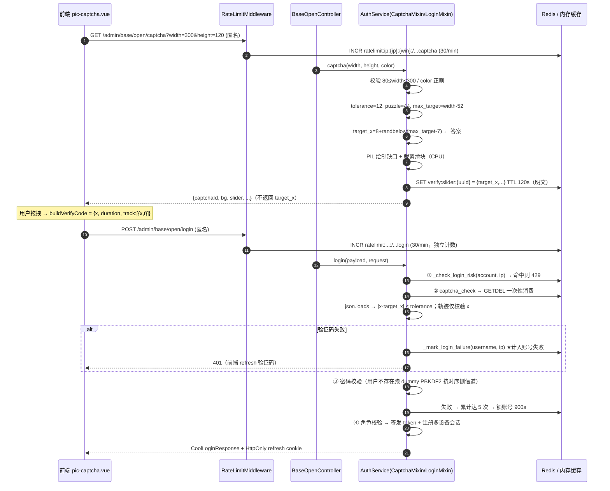

# Loom 登录链路验证码专项分析报告

> 分析日期：2026-10-05　|　分析对象：登录链路中的滑块验证码（slider captcha）
> 分析方法：源码逐行核验 + 运行时复现（真实源码调用），非纯静态推测
> 参与角色：架构师 高见远（独立评审）、交付总监 齐活林（复核与汇编）

---

## 概览

本报告针对 Loom（Vue 3 + FastAPI + Redis/Celery 全栈平台）**登录链路中的验证码子系统**做专项安全与架构分析，定位其「是否真正具备抗自动化能力」，并给出可落地的修复优先级。

- **覆盖范围**：`backend/app/modules/base/service/auth_captcha.py`、`auth_login.py`、`cache_service.py`、`controller/admin/open.py`、`app/core/config.py`、`app/framework/middleware/rate_limit.py`、`frontend/src/modules/base/pages/login/components/pic-captcha.vue` 与 `pages/login/index.vue`。
- **写作基线**：所有结论引用具体文件与行号；关键结论已运行时复现。
- **结论摘要**：

| 级别 | 数量 | 要点 |
|---|---|---|
| **CRITICAL** | 2 | 两条**无需图像识别、100% 绕过**的路径：`NaN` 注入（任意配置通杀）与 `width` 参数自选（解空间坍塌）。**验证码在生产环境（强制启用）实际不构成有效防线。** |
| **HIGH** | 2 | 验证码失败被计入账号失败计数 → **仅凭用户名 5 次请求即可锁死任意账号**（DoS）；轨迹行为检测可完全伪造。 |
| **MEDIUM** | 4 | 签发限流粒度粗、Redis 降级导致多进程登录必失败、输入无长度上限、答案明文落 Redis。 |
| **LOW** | 4 | 健壮性/信息泄露/绑定缺失/审计缺失。 |

**核心判断**：验证码目前的价值 ≈ 0。真正在阻挡暴力破解的是**失败锁定 + 全局限流**这两层叠加防护；而失败锁定又被「验证码失败计入」反向武器化，成为 DoS 原语。这与 `docs/权限管理与登录模块设计.md` §7 宣称的「验证码一次性使用，防重放」在**机制上成立、在效果上被架空**。

---

## 1. 登录链路时序（GET /captcha → POST /login）



**校验顺序**为：账号/IP 锁定检查 → **验证码** → 密码 → 角色。验证码位于密码之前，这一位置决定了 H2 的可利用性。

---

## 2. 攻击面与威胁模型

**匿名可访问接口**（`open.py`，均 `anonymous=True`）：

| 接口 | 位置 | 客户端可控输入 |
|---|---|---|
| `GET /admin/base/open/captcha` | `open.py:100-109` | `width` / `height` / `color`（**直接决定答案解空间**） |
| `POST /admin/base/open/login` | `open.py:69-82` | `username` / `password` / `captchaId` / `verifyCode` |
| `GET /admin/base/open/config` | `open.py:111-113` | 泄露 `captchaEnabled`（辅助攻击面判断） |

**可枚举量 / 成本模型**：

- `captchaId = uuid4().hex`（128-bit）—— 不可枚举 ✅
- 但**答案的解空间由客户端可控的 `width` 决定**：`width=80` 时候选位置仅 21 个，而容差固定 12px（`config.py:87`）→ 解空间坍塌。
- 匿名限流回退为 `ip:{ip}`（`rate_limit.py:69-77`），`/admin/base/open` 前缀限 **30/min/IP**（`config.py:124`）；且限流 key 含完整 `path`（`rate_limit.py:95`）→ **`/captcha` 与 `/login` 各自独立计数**。

**两类防御必须分开看**：

1. **验证码自身强度**（本应承担人机区分/抗自动化）：因 C1、C2、H1 而**实质归零**。
2. **叠加防护**（全局限流 + 失败锁定）：仍然有效，但它们挡的是「频率」，不是「机器人」；且失败锁定被 H2 反噬。

**信任边界**：答案以明文 JSON 存于 Redis（M3）；Redis 故障时静默降级为**进程内内存**（M4），在生产强制启用验证码（`config.py:228-236`，`DEBUG=False` 恒为 True）的前提下会造成「登录必失败」。

---

## 3. 问题清单

> 级别：CRITICAL > HIGH > MEDIUM > LOW。复现思路均为脚本可完成，**无需任何图像识别**。

### C1 — CRITICAL：`NaN` 注入导致位置校验恒真（任意配置通杀）

| 项 | 内容 |
|---|---|
| **结论** | `verifyCode` 中 `x` 传 `NaN` 时，`abs(NaN - target_x) > tolerance` 恒为 `False`，位置校验与轨迹末点校验同时被绕过，**任意 width 下 100% 通过**。 |
| **证据** | `auth_captcha.py:173` `final_x = float(payload["x"])`；`:179` `if abs(final_x - target_x) > tolerance:`；`:204` `if abs(previous_x - final_x) > tolerance:`。Python `json.loads` 默认 `allow_nan=True`，`'{"x": NaN}'` 解析为 `float('nan')`；IEEE-754 规定任何与 NaN 的比较（含 `>`）均为 `False`，故两个 `if` 都不触发。 |
| **影响** | 验证码被完全绕过，登录仅剩密码一道防线；可脚本化无限猜密码（受账号锁定/限流约束，但见 H2）。 |
| **复现** | `POST /admin/base/open/login`，`verifyCode='{"x":NaN,"duration":1000,"track":[6 个单调递增点]}'`，`captchaId` 用刚签发的任一 id。 |
| **修复** | ① `json.loads(..., parse_constant=...)` 拒绝 `NaN/Infinity/-Infinity`；② 解析后对 `final_x`、`target_x`、`previous_x`、`current_x` 强制 `math.isfinite()`，非有限值直接 401。**单点修复、收益最大，建议最优先。** |

### C2 — CRITICAL：`width` 参数可自选，解空间坍塌导致 100% 绕过

| 项 | 内容 |
|---|---|
| **结论** | `width` 由调用方自选且下限 80。取 `width=80` 时候选位置仅 `[8,28]`，而容差 ±12 → 存在**万能 x 区间 `[16,20]`**，对任意 `target_x` 恒命中。 |
| **证据** | `open.py:103` `width:int=150`（可传 80）；`auth_captcha.py:18` `CAPTCHA_WIDTH_MIN=80`；`:110` `tolerance=12`；`:112` `max_target=width-44-8`；`:118` `target_x=8+randbelow(max_target-8+1)`。**核算**：`width=80 → max_target=28 → target_x∈[8,28]`；令 `x=18` 时 `|18-target_x| ≤ 10 < 12` 恒成立。 |
| **影响** | 抗自动化能力归零；与 C1 并列为主要绕过路径（C1 更隐蔽，C2 更「正统」）。 |
| **复现** | `GET /captcha?width=80` 取 `captchaId`，再 `POST /login` 传 `verifyCode='{"x":18,"duration":720,"track":[...单调递增...]}'`。 |
| **修复** | ① **服务端固定宽高**，不信任客户端 `width`；或 ② 强制不变式 `候选位置数 ≥ K × 容差带`（建议 K≥10），例如要求 `max_target ≥ 10 × 2×tolerance`；③ 容差按比例：`tolerance = max(4, round(0.03 × max_target))`；④ 至少将 `width` 下界抬到使候选位置数 ≥ 200。 |

### H2 — HIGH：验证码失败计入账号失败 → 账号锁定 DoS

| 项 | 内容 |
|---|---|
| **结论** | 验证码校验抛错时会调用 `_mark_login_failure(payload.username, login_ip)`，而该路径**只需提交任意 username 与错误/缺失的验证码，无需任何有效凭证**。累计达 `BASE_LOGIN_ACCOUNT_FAIL_MAX=5` 即锁定账号 900s。 |
| **证据** | `auth_login.py:70-82`（`:74` 调用 `_mark_login_failure`）；`:297-309` `_mark_login_failure`；`config.py:92-94`（`ACCOUNT_FAIL_MAX=5`、`LOCK_TIME=900`）；`auth_captcha.py:154-155` 缺 `captcha_id` 立即 401。 |
| **影响** | 仅凭用户名即可锁死任意账号 15 分钟；换 IP 可持续重锁 → **持久 DoS**。也是唯一「免凭证累加账号失败计数」的入口。 |
| **复现** | `POST /login {"username":"admin","password":"x"}` 连续 5 次（不带 captchaId）；第 6 次起 `_check_login_risk` 命中 → `admin` 被 429 锁定 15 分钟。 |
| **修复** | ① 验证码失败**不调用** `_mark_login_failure`，改用独立计数器（如 `login:fail:captcha`）；② 账号锁定仅由「密码错误/用户不存在」驱动；③ 锁定事件接入审计告警。 |

### H1 — HIGH：轨迹行为检测可完全伪造

| 项 | 内容 |
|---|---|
| **结论** | `track` 每点的 `t` 字段在服务端**从未被读取**；`duration` 来自前端自报，且与 `track` 时间轴、服务端签发时间均无交叉校验 → 人机行为检测实质失效。 |
| **证据** | `auth_captcha.py:174` `duration_ms=int(payload["duration"])`；`:181` 仅校验 `duration_ms < 450`；`:188-200` 循环**只读 `point["x"]`**；`:131` `created_at` 写入缓存但校验时从不比对。 |
| **影响** | 任意脚本构造 6 点单调轨迹 + `duration=720` 即可通过，无任何行为门槛。 |
| **修复** | ① 服务端记录 `issued_at`，校验提交耗时落在合理窗口；② 读取并校验 `t` 的单调性/加速度自洽；③ `duration` 与 `track` 时长比对；④ 明确定位为「弱防护」，不作为主防线。 |

### M4 — MEDIUM（可用性可升 HIGH）：Redis 降级导致多进程验证码必失败

| 项 | 内容 |
|---|---|
| **结论** | `get_redis_client()` 一旦 ping 失败即置 `_redis_unavailable=True` **永久 latch**，降级到**进程内** `_memory_cache`；多进程部署下「签发进程」与「校验进程」内存不共享 → 验证码必然失败；且 `cache_set` 写失败（返回 `False`）时 `captcha()` 忽略返回值仍返回 200，产生「永远错」的 `captchaId`。 |
| **证据** | `cache_service.py:64-65/73`（latch 永不复位）；`:82-85`（client 为 None 写内存，**无 DEBUG 守卫**）；`:126-143`（GETDEL 降级为进程内 get+delete）；`auth_captcha.py:124`（忽略 `cache_set` 返回值）；`config.py:228-236`（生产强制启用）。 |
| **影响** | Redis 抖动 → 全站登录 401（fail-closed 但等价于登录 DoS）。 |
| **修复** | ① 生产且启用验证码时 Redis 不可用应 fail-closed **明确报错**（503 或 `/config` 关闭验证码），而非静默降级；② `cache_set` 失败时 `captcha()` 报错；③ `_redis_unavailable` 改为退避重试；④ 内存降级仅限 DEBUG。 |

### M1 — MEDIUM：`/captcha` 签发限流粒度粗、无图像复用

- **证据**：`rate_limit.py:87/95`（按完整 path 计数）；`config.py:124` `RATE_LIMIT_OPEN=30`；`auth_captcha.py:121` 每次签发都执行 PIL 绘制 + PNG base64。
- **影响**：分布式（换 IP）可线性放大 → CPU/带宽被图像生成拖垮。
- **修复**：`/captcha` 独立更低配额 + 全局配额；背景图复用（仅随机缺口）；限制尺寸上限；同一 IP 未消费额度递减。

### M2 — MEDIUM：`verify_code` / `track` 无长度上限

- **证据**：`model/auth.py:119-120`（`verify_code: str` 无 `max_length`）；`auth_captcha.py:163` `json.loads(verify_code)`；`:183` 仅校验 `len(track) ≥ 6`（**无上限**）；`:188` 全量遍历。全仓未见请求体大小中间件。
- **影响**：单请求携带数 MB JSON + 数十万轨迹点，占用工作线程 CPU/内存（配 C1 更可直通）。
- **修复**：`verify_code` 加 `max_length`（如 4KB）；`track` 点数上限（如 ≤300）；增加请求体大小中间件（如 256KB）。

### M3 — MEDIUM：答案明文存于 Redis

- **证据**：`auth_captcha.py:124-136` `cache_set(key, json.dumps({"type":"slider","target_x":target_x,...}))`。
- **影响**：任何可读 Redis 的主体遍历 `verify:slider:*` 即得全部答案（配合 C2 的 21 值空间几乎瞬间暴力）。
- **修复**：改存 `HMAC(target_x, server_secret)`；确保 Redis 仅内网 + ACL。

### L1 — LOW：`challenge` 非 dict 时 500

- `auth_captcha.py:161-165` try 仅包住 `json.loads`，`:167` `challenge.get("type")` 在 try 外 → 若缓存被写入非 dict 值则 `AttributeError` → 500（而非统一 401）。经确认 `verify:slider:*` 仅由 `captcha()` 以 uuid4 写入，**远程不可直接触发**，属健壮性问题。修复：`:167` 移入 try 或先判 `isinstance(challenge, dict)`。

### L2 — LOW：失败文案不一致，为调参提供差异化反馈

- `auth_captcha.py:155/160/182/184/190/194/199/203/205` 各分支 detail 不同（"不能为空"/"速度过快"/"轨迹异常"/"不正确"）。建议对外统一文案，细分原因记服务端日志。

### L3 — LOW：验证码未与 username/IP 绑定；`target_y` 恒定

- `auth_captcha.py:119` `target_y=(height-puzzle_size)//2` 确定性；`captcha_check` 不接收 username/IP。一次性虽限制复用，但未绑定登录主体。建议签发时绑定并随机化 y。

### L4 — LOW：缺少验证码维度指标与异常入参审计

- 无 captcha 失败率、异常 `width`（下界）、非有限 `float`（NaN）入参的计数与告警。建议接入 `SysSecurityLogService` 与 metric。

---

## 4. 独立复核记录（本轮实测）

为排除纯静态推测，对两个 CRITICAL 结论做了运行时复现（脚本仅读、不修改项目文件）。

**Part A — 数值/语言行为复核**

```
json.loads 接受 NaN: {'x': nan}
isnan(v): True
abs(nan - 123.0) > 12 -> False      ← C1：比较恒 False
abs(50.0 - nan)  > 12 -> False      ← C1：轨迹末点校验同样失效
width=80 : target_x∈[8,28] (21 个位置); 万能 x=[16,17,18,19,20]; 命中 21/21 = 100.0%   ← C2
width=150: target_x∈[8,98] (91 个位置); 居中 x 命中 25/91 = 27.5%
width=300: target_x∈[8,248] (241 个位置); 居中 x 命中 25/241 = 10.4%
```

**Part B — 调用真实源码 `CaptchaMixin.captcha_check`**（`backend/venv` 解释器，缓存答案 `target_x=123`、`tolerance=12`）

```
提交 verifyCode = {"x": NaN, "duration": 1000, "track": [6 个单调递增点]}
真实答案 target_x = 123，容差 = 12
>>> captcha_check 正常返回（未抛异常）=> NaN 绕过【成立】
>>> 对照组 x=60(错) 被拒 => 验证码不正确或已失效   ← 说明校验逻辑本身在工作，仅被 NaN 短路
```

**结论**：C1 已在**真实代码路径**上复现；C2 已在算法层面证实（万能 x 区间存在）。C1、C2 均为可直接利用的绕过，判定 CRITICAL 成立。

---

## 5. 与既有设计的偏差（对照 `docs/权限管理与登录模块设计.md` §7）

| §7 宣称 | 实现现状 | 偏差判定 |
|---|---|---|
| 「验证码一次性使用，防重放」 | GETDEL 一次性消费**已实现**（`auth_captcha.py:157-158` + `cache_service.py:126-143`） | **机制成立、效果被架空**：攻击者无需「同一验证码用两次」——`NaN` 或 `width=80` 下的固定 `x`，对**每个新签发的验证码**都成立。单次消费防住了重放，防不住「每次都用同一个万能答案」。 |
| 「登录失败按账号和 IP 临时锁定」 | 已实现（`auth_login.py:297-309`） | **偏差**：验证码失败被并入账号失败计数（`auth_login.py:74`），使该防护被武器化为 **DoS 原语**（H2），设计文档未预见「免 Solve 累加账号失败」。 |
| §1「Redis 不可用时**开发环境**降级为进程内缓存」 | 降级**无条件生效**（`cache_service.py:82-85`，无 DEBUG 守卫），而生产强制启用验证码 | **文档表述（dev-only）与实现（all env）不一致** → 即 M4。 |

其余项（PBKDF2 迭代升级、CSRF Origin 校验、审计日志）实现与文档一致，未发现偏差。

---

## 6. 修复优先级与最小改动集

**P0（立即，阻断绕过）**

1. **C1**：`auth_captcha.py` 解析后用 `math.isfinite()` 校验 `final_x/target_x/previous_x`；`json.loads` 用 `parse_constant` 拒绝 `NaN/Infinity`。
2. **C2**：`captcha()` 不再用客户端 `width` 决定解空间 —— 服务端固定尺寸，或强制 `候选位置数 ≥ K × 容差带`（K≥10），并下调/按比例化 `CAPTCHA_SLIDER_TOLERANCE`。

**P1（本周，消除 DoS 与防护失效）**

3. **H2**：从验证码失败分支移除 `_mark_login_failure`（或改独立计数）。
4. **H1**：服务端记录 `issued_at` 并校验提交耗时窗口；读取并校验 `t`。
5. **M4**：Redis 不可用且生产启用验证码时 fail-closed 明确报错；`captcha()` 尊重 `cache_set` 返回值；latch 改退避重试。

**P2（加固与可观测）**

6. **M2**：`verify_code` 长度上限 + `track` 点数上限 + 请求体大小中间件。
7. **M3**：答案改存 HMAC（或强化 Redis ACL）。
8. **M1**：`/captcha` 独立更低配额 + 背景图复用。
9. **L1–L4**：统一错误文案、captcha↔username/IP 绑定、异常入参 metric/审计。

**最小改动集（4 处，即可同时消除 2 个 CRITICAL 与主要 DoS）**

```
① auth_captcha.py  解析后 isfinite 校验 + parse_constant 拒绝 NaN/Infinity   → 修 C1
② auth_captcha.py  captcha()：宽度服务端固定 / 强制 max_target ≥ K×容差带    → 修 C2
③ auth_login.py    验证码失败分支：删除 _mark_login_failure（或独立计数）      → 修 H2
④ auth_captcha.py  增加服务端 issued_at 时效校验 + 读取轨迹 t                  → 修 H1
```

---

## 7. 测试缺口

现有 `backend/tests/test_auth_security_fixes.py:52-118`（`CaptchaValidationTests`）**仅覆盖参数边界**（width 79/301、height 79/301、颜色格式），**完全未覆盖**：

- C1：`NaN`/`Infinity` 注入入参
- C2：`width=80` 万能 x
- H1：伪造单调轨迹
- H2：5 次无验证码请求锁号
- 并发下 GETDEL 仅一次成功
- Redis 降级时的多进程一致性
- 超大 `verify_code` / 超长 `track`

`_slider_verify_code()`（`:40-49`）走的是「从缓存读答案构造合法请求」的**正确路径**，天然不会触及任何绕过分支 —— 这是两个 CRITICAL 长期未被发现的原因。

---

## 8. 待确认项

1. **生产部署拓扑**：是否多 uvicorn worker / Celery 是否处理登录请求 —— 直接决定 M4 在生产是否可复现（代码层已确认降级为进程内）。**已核查（2026-10-05）**：修复后 M4 不再依赖拓扑答案——生产 Redis 不可用时签发直接 503 fail-closed，多进程内存降级路径已在生产关闭。
2. **反向代理（nginx）是否设置请求体大小上限** —— **已核查**：`frontend/nginx.conf` 无自定义 `client_max_body_size`，维持 nginx 默认 1MB 兜底；应用层 M2 以 DTO `max_length`（verify_code≤4096）+ 轨迹点数上限（≤300）收口，不再加全局请求体中间件。
3. **是否存在运维/脚本对 `verify:slider:*` 的写入** —— 全仓 Grep 未见，故 L1 判为不可远程触发。M3 封存后该前缀整体变为密文，外部写入必然解封失败（401）。

---

## 9. 处理记录（2026-10-05 修复落地，三批次）

| 编号 | 级别 | 处理 | 提交 |
|---|---|---|---|
| C1 | CRITICAL | `parse_constant` 拒绝 NaN/Infinity + `isfinite` 纵深；附带修复报告未点到的 `1e999→inf→int(inf) OverflowError 500` | 3d1254c |
| C2 | CRITICAL | 渲染与答案解空间服务端固定 300×120（前端本就上报该尺寸，零影响）+ 不变式守卫（候选位置数 < 10×容差带 → 500 拒签） | 3d1254c |
| H2 | HIGH | `_mark_login_failure` 增 `count_account` 参数；验证码失败只计 IP 计数（20 次/15min 锁约束保留），账号锁定仅由密码错误驱动 | ad21b7e |
| H1 | HIGH | 轨迹时间轴交叉校验：t 非负单调、末点 ≤ duration+200ms、duration−末点 ≤ 5s、duration ≤ TTL 窗口；docstring 明示弱防护定位（强度来自一次性消费+失败锁定+限流叠加） | ad21b7e |
| M4 | MEDIUM | `cache_set` 增 `allow_memory_fallback`；生产 Redis 不可用签发明确 503（fail-closed），开发保持内存回退；`_redis_unavailable` 永久 latch 改 30s 退避重试 | cbb137e |
| M1 | MEDIUM | per-IP 签发限流 100 次/300s（`CAPTCHA_ISSUE_MAX_PER_WINDOW`）；背景图复用不做——维持噪声随机（反 OCR），CPU 成本由限流+签发上限兜底 | cbb137e |
| M2 | MEDIUM | `verify_code ≤ 4096`/`captcha_id ≤ 64`（DTO max_length）+ 轨迹点数 ≤ 300；全局请求体中间件不加（nginx 默认 1MB 兜底，见 §8-2） | ad21b7e/cbb137e |
| M3 | MEDIUM | 签发载荷 Fernet 封存（JWT_SECRET 派生密钥），缓存侧全密文、解封失败统一 401；「Redis 内网+ACL」属运维项，随部署核查留档 | cbb137e |
| L1 | LOW | challenge 非 dict/密文篡改统一 401（封存后外部写入必解封失败） | 3d1254c |
| L2 | LOW | 对外文案统一「验证码不正确或已失效」，不给调参提供差异化反馈 | ad21b7e |
| L3 | LOW | 绑定签发 IP（login 提交比对，同源 `auth_request_info` 提取）+ 缺口纵向位置随机化 | cbb137e |
| L4 | LOW | NaN 常量/非有限值/签发限流触发 warning 日志；SysSecurityLog 指标化留待后续需要时立项 | 本批 |

**回归**：新增 `tests/test_captcha_bypass.py` 21 用例（绕过/锁号/加固三组），验证码相关 5 测试文件 72 用例绿；既有 CaptchaValidationTests 边界用例无回归。测试辅助统一收敛 `tests/helpers.py::captcha_target_x`（解封读答案）。

---

*本报告由软件开发团队（架构师 高见远 评审 / 交付总监 齐活林 复核汇编）产出；C1、C2 的关键结论已运行时复现。修复落地见 §9 处理记录。*
