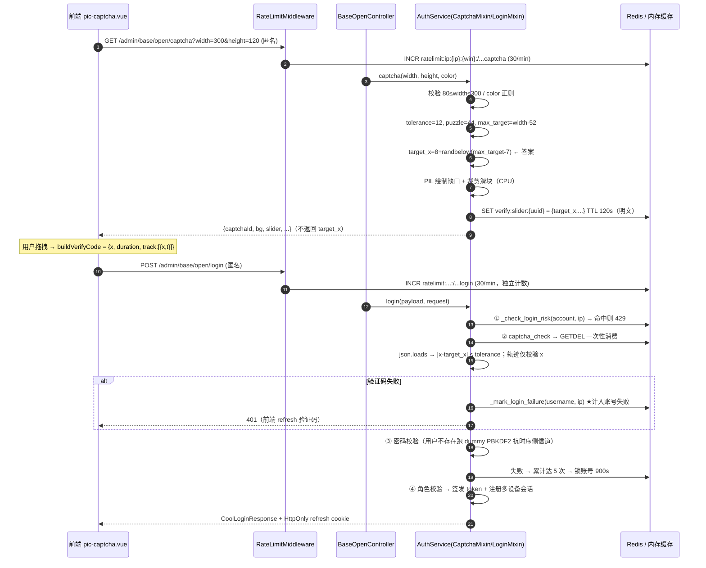

# Loom 登录链路专项分析报告（验证码 + 其余逻辑）

> 分析日期：2026-10-05　|　分析对象：登录链路 —— §1–§13 为**验证码子系统**，§14 为**其余逻辑**  
> 分析方法：源码逐行核验 + 运行时复现（真实源码调用），非纯静态推测  
> 参与角色：架构师 高见远（独立评审）、交付总监 齐活林（复核与汇编）；QA 严过关（独立复审）
>
> **状态（2026-10-05 18:55 更新）**：§3 所列问题**已于当日下午全部修复并入库**（提交 `3d1254c` → `e0908d1`，见 §9）。独立复审判定：§3 的结论对**修复前基线 `c644027`** 全部成立、行号准确，且 §9 的修复在当前 HEAD 实测生效（见 §10）。**阅读 §3 时请勿据此判定现网仍存在漏洞。**
>
> **重要补充（§13，UI 级实测）**：修复只解决了「被绕过得更廉价」；**「视觉挑战可被朴素图像算法 100% 解出」这一固有短板在修复后依然存在**（36/36 精确命中，偏差 0px）。验证码应被定位为**成本抬升**手段，而非人机区分主防线。
>
> **§14 新增（登录链路其余逻辑专项评审）**：验证码之外的 10 项问题，其中 **R2 揭示 H2「账号锁 DoS」实质未修复**、**R3 发现 IP 锁可被自有账号清零**、**R10 发现登出/踢设备回收不了历史 access token**、**R7 refresh 无重用检测**。§9/§10 的「H2 已修复」应限定为「**免验证码路径**已关闭」——因验证码 100% 可解，攻击者仍可 5 次「解码+错密码」锁死任意账号。**R2/R3/R10 建议列为本轮 P0。**

---

## 概览

本报告针对 Loom（Vue 3 + FastAPI + Redis/Celery 全栈平台）**登录链路中的验证码子系统**做专项安全与架构分析，定位其「是否真正具备抗自动化能力」，并给出可落地的修复优先级。

- **覆盖范围**：`backend/app/modules/base/service/auth_captcha.py`、`auth_login.py`、`cache_service.py`、`controller/admin/open.py`、`app/core/config.py`、`app/framework/middleware/rate_limit.py`、`frontend/src/modules/base/pages/login/components/pic-captcha.vue` 与 `pages/login/index.vue`。
- **写作基线**：所有结论引用具体文件与行号；关键结论已运行时复现。
- **结论摘要**：

| 级别           | 数量 | 要点                                                                                         |
| ------------ | -- | ------------------------------------------------------------------------------------------ |
| **CRITICAL** | 2  | 两条**无需图像识别、100% 绕过**的路径：`NaN` 注入（任意配置通杀）与 `width` 参数自选（解空间坍塌）。**验证码在生产环境（强制启用）实际不构成有效防线。** |
| **HIGH**     | 2  | 验证码失败被计入账号失败计数 → **仅凭用户名 5 次请求即可锁死任意账号**（DoS）；轨迹行为检测可完全伪造。                                 |
| **MEDIUM**   | 4  | 签发限流粒度粗、Redis 降级导致多进程登录必失败、输入无长度上限、答案明文落 Redis。                                            |
| **LOW**      | 4  | 健壮性/信息泄露/绑定缺失/审计缺失。                                                                        |

**核心判断**：验证码目前的价值 ≈ 0。真正在阻挡暴力破解的是**失败锁定 + 全局限流**这两层叠加防护；而失败锁定又被「验证码失败计入」反向武器化，成为 DoS 原语。这与 `docs/权限管理与登录模块设计.md` §7 宣称的「验证码一次性使用，防重放」在**机制上成立、在效果上被架空**。

---

## 1. 登录链路时序（GET /captcha → POST /login）



**校验顺序**为：账号/IP 锁定检查 → **验证码** → 密码 → 角色。验证码位于密码之前，这一位置决定了 H2 的可利用性。

---

## 2. 攻击面与威胁模型

**匿名可访问接口**（`open.py`，均 `anonymous=True`）：

| 接口                             | 位置                | 客户端可控输入                                              |
| ------------------------------ | ----------------- | ---------------------------------------------------- |
| `GET /admin/base/open/captcha` | `open.py:100-109` | `width` / `height` / `color`（**直接决定答案解空间**）          |
| `POST /admin/base/open/login`  | `open.py:69-82`   | `username` / `password` / `captchaId` / `verifyCode` |
| `GET /admin/base/open/config`  | `open.py:111-113` | 泄露 `captchaEnabled`（辅助攻击面判断）                         |

**可枚举量 / 成本模型**：

- `captchaId = uuid4().hex`（128-bit）—— 不可枚举 ✅
- 但**答案的解空间由客户端可控的 `width` 决定**：`width=80` 时候选位置仅 21 个，而容差固定 12px（`config.py:87`）→ 解空间坍塌。
- 匿名限流回退为 `ip:{ip}`（`rate_limit.py:69-77`），`/admin/base/open` 前缀限 **30/min/IP**（`config.py:124`）；且限流 key 含完整 `path`（`rate_limit.py:95`）→ **`/captcha` 与 `/login` 各自独立计数**。

**两类防御必须分开看**：

1. **验证码自身强度**（本应承担人机区分/抗自动化）：因 C1、C2、H1 而**实质归零**。
2. **叠加防护**（全局限流 + 失败锁定）：仍然有效，但它们挡的是「频率」，不是「机器人」；且失败锁定被 H2 反噬。

**信任边界**：答案以明文 JSON 存于 Redis（M3）；Redis 故障时静默降级为**进程内内存**（M4），在生产强制启用验证码（`config.py:228-236`，`DEBUG=False` 恒为 True）的前提下会造成「登录必失败」。

---

## 3. 问题清单

> ⚠️ **版本提示（2026-10-05 复审补注）**：本节的行号与结论对应**修复前基线 `c644027`**。全部条目已在 `3d1254c`…`e0908d1` 修复（§9），并通过独立复审（§10）。在当前 HEAD 上重读本节会「对不上号」——请以 §9/§10 为准。
>
> 级别：CRITICAL > HIGH > MEDIUM > LOW。复现思路均为脚本可完成，**无需任何图像识别**。

### C1 — CRITICAL：`NaN` 注入导致位置校验恒真（任意配置通杀）

| 项      | 内容                                                                                                                                                                                                                                                                                         |
| ------ | ------------------------------------------------------------------------------------------------------------------------------------------------------------------------------------------------------------------------------------------------------------------------------------------ |
| **结论** | `verifyCode` 中 `x` 传 `NaN` 时，`abs(NaN - target_x) > tolerance` 恒为 `False`，位置校验与轨迹末点校验同时被绕过，**任意 width 下 100% 通过**。                                                                                                                                                                         |
| **证据** | `auth_captcha.py:173` `final_x = float(payload["x"])`；`:179` `if abs(final_x - target_x) > tolerance:`；`:204` `if abs(previous_x - final_x) > tolerance:`。Python `json.loads` 默认 `allow_nan=True`，`'{"x": NaN}'` 解析为 `float('nan')`；IEEE-754 规定任何与 NaN 的比较（含 `>`）均为 `False`，故两个 `if` 都不触发。 |
| **影响** | 验证码被完全绕过，登录仅剩密码一道防线；可脚本化无限猜密码（受账号锁定/限流约束，但见 H2）。                                                                                                                                                                                                                                           |
| **复现** | `POST /admin/base/open/login`，`verifyCode='{"x":NaN,"duration":1000,"track":[6 个单调递增点]}'`，`captchaId` 用刚签发的任一 id。                                                                                                                                                                          |
| **修复** | ① `json.loads(..., parse_constant=...)` 拒绝 `NaN/Infinity/-Infinity`；② 解析后对 `final_x`、`target_x`、`previous_x`、`current_x` 强制 `math.isfinite()`，非有限值直接 401。**单点修复、收益最大，建议最优先。**                                                                                                              |

### C2 — CRITICAL：`width` 参数可自选，解空间坍塌导致 100% 绕过

| 项      | 内容                                                                                                                                                                                                                                                    |             |                  |
| ------ | ----------------------------------------------------------------------------------------------------------------------------------------------------------------------------------------------------------------------------------------------------- | ----------- | ---------------- |
| **结论** | `width` 由调用方自选且下限 80。取 `width=80` 时候选位置仅 `[8,28]`，而容差 ±12 → 存在**万能 x 区间 `[16,20]`**，对任意 `target_x` 恒命中。                                                                                                                                               |             |                  |
| **证据** | `open.py:103` `width:int=150`（可传 80）；`auth_captcha.py:18` `CAPTCHA_WIDTH_MIN=80`；`:110` `tolerance=12`；`:112` `max_target=width-44-8`；`:118` `target_x=8+randbelow(max_target-8+1)`。**核算**：`width=80 → max_target=28 → target_x∈[8,28]`；令 `x=18` 时 \` | 18-target_x | ≤ 10 < 12\` 恒成立。 |
| **影响** | 抗自动化能力归零；与 C1 并列为主要绕过路径（C1 更隐蔽，C2 更「正统」）。                                                                                                                                                                                                             |             |                  |
| **复现** | `GET /captcha?width=80` 取 `captchaId`，再 `POST /login` 传 `verifyCode='{"x":18,"duration":720,"track":[...单调递增...]}'`。                                                                                                                                  |             |                  |
| **修复** | ① **服务端固定宽高**，不信任客户端 `width`；或 ② 强制不变式 `候选位置数 ≥ K × 容差带`（建议 K≥10），例如要求 `max_target ≥ 10 × 2×tolerance`；③ 容差按比例：`tolerance = max(4, round(0.03 × max_target))`；④ 至少将 `width` 下界抬到使候选位置数 ≥ 200。                                                         |             |                  |

### H2 — HIGH：验证码失败计入账号失败 → 账号锁定 DoS

| 项      | 内容                                                                                                                                                                                              |
| ------ | ----------------------------------------------------------------------------------------------------------------------------------------------------------------------------------------------- |
| **结论** | 验证码校验抛错时会调用 `_mark_login_failure(payload.username, login_ip)`，而该路径**只需提交任意 username 与错误/缺失的验证码，无需任何有效凭证**。累计达 `BASE_LOGIN_ACCOUNT_FAIL_MAX=5` 即锁定账号 900s。                                       |
| **证据** | `auth_login.py:70-82`（`:74` 调用 `_mark_login_failure`）；`:297-309` `_mark_login_failure`；`config.py:92-94`（`ACCOUNT_FAIL_MAX=5`、`LOCK_TIME=900`）；`auth_captcha.py:154-155` 缺 `captcha_id` 立即 401。 |
| **影响** | 仅凭用户名即可锁死任意账号 15 分钟；换 IP 可持续重锁 → **持久 DoS**。也是唯一「免凭证累加账号失败计数」的入口。                                                                                                                               |
| **复现** | `POST /login {"username":"admin","password":"x"}` 连续 5 次（不带 captchaId）；第 6 次起 `_check_login_risk` 命中 → `admin` 被 429 锁定 15 分钟。                                                                  |
| **修复** | ① 验证码失败**不调用** `_mark_login_failure`，改用独立计数器（如 `login:fail:captcha`）；② 账号锁定仅由「密码错误/用户不存在」驱动；③ 锁定事件接入审计告警。                                                                                       |

### H1 — HIGH：轨迹行为检测可完全伪造

| 项      | 内容                                                                                                                                                             |
| ------ | -------------------------------------------------------------------------------------------------------------------------------------------------------------- |
| **结论** | `track` 每点的 `t` 字段在服务端**从未被读取**；`duration` 来自前端自报，且与 `track` 时间轴、服务端签发时间均无交叉校验 → 人机行为检测实质失效。                                                                   |
| **证据** | `auth_captcha.py:174` `duration_ms=int(payload["duration"])`；`:181` 仅校验 `duration_ms < 450`；`:188-200` 循环**只读 `point["x"]`**；`:131` `created_at` 写入缓存但校验时从不比对。 |
| **影响** | 任意脚本构造 6 点单调轨迹 + `duration=720` 即可通过，无任何行为门槛。                                                                                                                  |
| **修复** | ① 服务端记录 `issued_at`，校验提交耗时落在合理窗口；② 读取并校验 `t` 的单调性/加速度自洽；③ `duration` 与 `track` 时长比对；④ 明确定位为「弱防护」，不作为主防线。                                                       |

### M4 — MEDIUM（可用性可升 HIGH）：Redis 降级导致多进程验证码必失败

| 项      | 内容                                                                                                                                                                                                                   |
| ------ | -------------------------------------------------------------------------------------------------------------------------------------------------------------------------------------------------------------------- |
| **结论** | `get_redis_client()` 一旦 ping 失败即置 `_redis_unavailable=True` **永久 latch**，降级到**进程内** `_memory_cache`；多进程部署下「签发进程」与「校验进程」内存不共享 → 验证码必然失败；且 `cache_set` 写失败（返回 `False`）时 `captcha()` 忽略返回值仍返回 200，产生「永远错」的 `captchaId`。 |
| **证据** | `cache_service.py:64-65/73`（latch 永不复位）；`:82-85`（client 为 None 写内存，**无 DEBUG 守卫**）；`:126-143`（GETDEL 降级为进程内 get+delete）；`auth_captcha.py:124`（忽略 `cache_set` 返回值）；`config.py:228-236`（生产强制启用）。                       |
| **影响** | Redis 抖动 → 全站登录 401（fail-closed 但等价于登录 DoS）。                                                                                                                                                                         |
| **修复** | ① 生产且启用验证码时 Redis 不可用应 fail-closed **明确报错**（503 或 `/config` 关闭验证码），而非静默降级；② `cache_set` 失败时 `captcha()` 报错；③ `_redis_unavailable` 改为退避重试；④ 内存降级仅限 DEBUG。                                                             |

### M1 — MEDIUM：`/captcha` 签发限流粒度粗、无图像复用

- **证据**：`rate_limit.py:87/95`（按完整 path 计数）；`config.py:124` `RATE_LIMIT_OPEN=30`；`auth_captcha.py:121` 每次签发都执行 PIL 绘制 + PNG base64。
- **影响**：分布式（换 IP）可线性放大 → CPU/带宽被图像生成拖垮。
- **修复**：`/captcha` 独立更低配额 + 全局配额；背景图复用（仅随机缺口）；限制尺寸上限；同一 IP 未消费额度递减。

### M2 — MEDIUM：`verify_code` / `track` 无长度上限

- **证据**：`model/auth.py:119-120`（`verify_code: str` 无 `max_length`）；`auth_captcha.py:163` `json.loads(verify_code)`；`:183` 仅校验 `len(track) ≥ 6`（**无上限**）；`:188` 全量遍历。全仓未见请求体大小中间件。
- **影响**：单请求携带数 MB JSON + 数十万轨迹点，占用工作线程 CPU/内存（配 C1 更可直通）。
- **修复**：`verify_code` 加 `max_length`（如 4KB）；`track` 点数上限（如 ≤300）；增加请求体大小中间件（如 256KB）。

### M3 — MEDIUM：答案明文存于 Redis

- **证据**：`auth_captcha.py:124-136` `cache_set(key, json.dumps({"type":"slider","target_x":target_x,...}))`。
- **影响**：任何可读 Redis 的主体遍历 `verify:slider:*` 即得全部答案（配合 C2 的 21 值空间几乎瞬间暴力）。
- **修复**：改存 `HMAC(target_x, server_secret)`；确保 Redis 仅内网 + ACL。

### L1 — LOW：`challenge` 非 dict 时 500

- `auth_captcha.py:161-165` try 仅包住 `json.loads`，`:167` `challenge.get("type")` 在 try 外 → 若缓存被写入非 dict 值则 `AttributeError` → 500（而非统一 401）。经确认 `verify:slider:*` 仅由 `captcha()` 以 uuid4 写入，**远程不可直接触发**，属健壮性问题。修复：`:167` 移入 try 或先判 `isinstance(challenge, dict)`。

### L2 — LOW：失败文案不一致，为调参提供差异化反馈

- `auth_captcha.py:155/160/182/184/190/194/199/203/205` 各分支 detail 不同（"不能为空"/"速度过快"/"轨迹异常"/"不正确"）。建议对外统一文案，细分原因记服务端日志。

### L3 — LOW：验证码未与 username/IP 绑定；`target_y` 恒定

- `auth_captcha.py:119` `target_y=(height-puzzle_size)//2` 确定性；`captcha_check` 不接收 username/IP。一次性虽限制复用，但未绑定登录主体。建议签发时绑定并随机化 y。

### L4 — LOW：缺少验证码维度指标与异常入参审计

- 无 captcha 失败率、异常 `width`（下界）、非有限 `float`（NaN）入参的计数与告警。建议接入 `SysSecurityLogService` 与 metric。

---

## 4. 独立复核记录（本轮实测）

为排除纯静态推测，对两个 CRITICAL 结论做了运行时复现（脚本仅读、不修改项目文件）。

**Part A — 数值/语言行为复核**

```
json.loads 接受 NaN: {'x': nan}
isnan(v): True
abs(nan - 123.0) > 12 -> False      ← C1：比较恒 False
abs(50.0 - nan)  > 12 -> False      ← C1：轨迹末点校验同样失效
width=80 : target_x∈[8,28] (21 个位置); 万能 x=[16,17,18,19,20]; 命中 21/21 = 100.0%   ← C2
width=150: target_x∈[8,98] (91 个位置); 居中 x 命中 25/91 = 27.5%
width=300: target_x∈[8,248] (241 个位置); 居中 x 命中 25/241 = 10.4%
```


**Part B — 调用真实源码 `CaptchaMixin.captcha_check`**（`backend/venv` 解释器，缓存答案 `target_x=123`、`tolerance=12`）

```
提交 verifyCode = {"x": NaN, "duration": 1000, "track": [6 个单调递增点]}
真实答案 target_x = 123，容差 = 12
>>> captcha_check 正常返回（未抛异常）=> NaN 绕过【成立】
>>> 对照组 x=60(错) 被拒 => 验证码不正确或已失效   ← 说明校验逻辑本身在工作，仅被 NaN 短路
```

**结论**：C1 已在**真实代码路径**上复现；C2 已在算法层面证实（万能 x 区间存在）。C1、C2 均为可直接利用的绕过，判定 CRITICAL 成立。

---

## 5. 与既有设计的偏差（对照 `docs/权限管理与登录模块设计.md` §7）

| §7 宣称 | 实现现状 | 偏差判定 |
|---|---|---|
| 「验证码一次性使用，防重放」 | GETDEL 一次性消费**已实现**（`auth_captcha.py:157-158` + `cache_service.py:126-143`） | **机制成立、效果被架空**：攻击者无需「同一验证码用两次」——`NaN` 或 `width=80` 下的固定 `x`，对**每个新签发的验证码**都成立。单次消费防住了重放，防不住「每次都用同一个万能答案」。 |
| 「登录失败按账号和 IP 临时锁定」 | 已实现（`auth_login.py:297-309`） | **偏差**：验证码失败被并入账号失败计数（`auth_login.py:74`），使该防护被武器化为 **DoS 原语**（H2），设计文档未预见「免 Solve 累加账号失败」。 |
| §1「Redis 不可用时**开发环境**降级为进程内缓存」 | 降级**无条件生效**（`cache_service.py:82-85`，无 DEBUG 守卫），而生产强制启用验证码 | **文档表述（dev-only）与实现（all env）不一致** → 即 M4。 |

其余项（PBKDF2 迭代升级、CSRF Origin 校验、审计日志）实现与文档一致，未发现偏差。

---

## 6. 修复优先级与最小改动集

**P0（立即，阻断绕过）**

1. **C1**：`auth_captcha.py` 解析后用 `math.isfinite()` 校验 `final_x/target_x/previous_x`；`json.loads` 用 `parse_constant` 拒绝 `NaN/Infinity`。
2. **C2**：`captcha()` 不再用客户端 `width` 决定解空间 —— 服务端固定尺寸，或强制 `候选位置数 ≥ K × 容差带`（K≥10），并下调/按比例化 `CAPTCHA_SLIDER_TOLERANCE`。

**P1（本周，消除 DoS 与防护失效）**

3. **H2**：从验证码失败分支移除 `_mark_login_failure`（或改独立计数）。
4. **H1**：服务端记录 `issued_at` 并校验提交耗时窗口；读取并校验 `t`。
5. **M4**：Redis 不可用且生产启用验证码时 fail-closed 明确报错；`captcha()` 尊重 `cache_set` 返回值；latch 改退避重试。

**P2（加固与可观测）**

6. **M2**：`verify_code` 长度上限 + `track` 点数上限 + 请求体大小中间件。
7. **M3**：答案改存 HMAC（或强化 Redis ACL）。
8. **M1**：`/captcha` 独立更低配额 + 背景图复用。
9. **L1–L4**：统一错误文案、captcha↔username/IP 绑定、异常入参 metric/审计。

**最小改动集（4 处，即可同时消除 2 个 CRITICAL 与主要 DoS）**

```
① auth_captcha.py  解析后 isfinite 校验 + parse_constant 拒绝 NaN/Infinity   → 修 C1
② auth_captcha.py  captcha()：宽度服务端固定 / 强制 max_target ≥ K×容差带    → 修 C2
③ auth_login.py    验证码失败分支：删除 _mark_login_failure（或独立计数）      → 修 H2
④ auth_captcha.py  增加服务端 issued_at 时效校验 + 读取轨迹 t                  → 修 H1
```

---

## 7. 测试缺口

现有 `backend/tests/test_auth_security_fixes.py:52-118`（`CaptchaValidationTests`）**仅覆盖参数边界**（width 79/301、height 79/301、颜色格式），**完全未覆盖**：

- C1：`NaN`/`Infinity` 注入入参
- C2：`width=80` 万能 x
- H1：伪造单调轨迹
- H2：5 次无验证码请求锁号
- 并发下 GETDEL 仅一次成功
- Redis 降级时的多进程一致性
- 超大 `verify_code` / 超长 `track`

`_slider_verify_code()`（`:40-49`）走的是「从缓存读答案构造合法请求」的**正确路径**，天然不会触及任何绕过分支 —— 这是两个 CRITICAL 长期未被发现的原因。

---

## 8. 待确认项

1. **生产部署拓扑**：是否多 uvicorn worker / Celery 是否处理登录请求 —— 直接决定 M4 在生产是否可复现（代码层已确认降级为进程内）。**已核查（2026-10-05）**：修复后 M4 不再依赖拓扑答案——生产 Redis 不可用时签发直接 503 fail-closed，多进程内存降级路径已在生产关闭。
2. **反向代理（nginx）是否设置请求体大小上限** —— **已核查**：`frontend/nginx.conf` 无自定义 `client_max_body_size`，维持 nginx 默认 1MB 兜底；应用层 M2 以 DTO `max_length`（verify_code≤4096）+ 轨迹点数上限（≤300）收口，不再加全局请求体中间件。
3. **是否存在运维/脚本对 `verify:slider:*` 的写入** —— 全仓 Grep 未见，故 L1 判为不可远程触发。M3 封存后该前缀整体变为密文，外部写入必然解封失败（401）。

---

## 9. 处理记录（2026-10-05 修复落地，三批次）

| 编号 | 级别 | 处理 | 提交 |
|---|---|---|---|
| C1 | CRITICAL | `parse_constant` 拒绝 NaN/Infinity + `isfinite` 纵深；附带修复报告未点到的 `1e999→inf→int(inf) OverflowError 500` | 3d1254c |
| C2 | CRITICAL | 渲染与答案解空间服务端固定 300×120（前端本就上报该尺寸，零影响）+ 不变式守卫（候选位置数 < 10×容差带 → 500 拒签） | 3d1254c |
| H2 | HIGH | `_mark_login_failure` 增 `count_account` 参数；验证码失败只计 IP 计数（20 次/15min 锁约束保留），账号锁定仅由密码错误驱动 | ad21b7e |
| H1 | HIGH | 轨迹时间轴交叉校验：t 非负单调、末点 ≤ duration+200ms、duration−末点 ≤ 5s、duration ≤ TTL 窗口；docstring 明示弱防护定位（强度来自一次性消费+失败锁定+限流叠加） | ad21b7e |
| M4 | MEDIUM | `cache_set` 增 `allow_memory_fallback`；生产 Redis 不可用签发明确 503（fail-closed），开发保持内存回退；`_redis_unavailable` 永久 latch 改 30s 退避重试 | cbb137e |
| M1 | MEDIUM | per-IP 签发限流 100 次/300s（`CAPTCHA_ISSUE_MAX_PER_WINDOW`）；背景图复用不做——维持噪声随机（反 OCR），CPU 成本由限流+签发上限兜底 | cbb137e |
| M2 | MEDIUM | `verify_code ≤ 4096`/`captcha_id ≤ 64`（DTO max_length）+ 轨迹点数 ≤ 300；全局请求体中间件不加（nginx 默认 1MB 兜底，见 §8-2） | ad21b7e/cbb137e |
| M3 | MEDIUM | 签发载荷 Fernet 封存（JWT_SECRET 派生密钥），缓存侧全密文、解封失败统一 401；「Redis 内网+ACL」属运维项，随部署核查留档 | cbb137e |
| L1 | LOW | challenge 非 dict/密文篡改统一 401（封存后外部写入必解封失败） | 3d1254c |
| L2 | LOW | 对外文案统一「验证码不正确或已失效」，不给调参提供差异化反馈 | ad21b7e |
| L3 | LOW | 绑定签发 IP（login 提交比对，同源 `auth_request_info` 提取）+ 缺口纵向位置随机化 | cbb137e |
| L4 | LOW | NaN 常量/非有限值/签发限流触发 warning 日志；SysSecurityLog 指标化留待后续需要时立项 | 本批 |

**回归**：新增 `tests/test_captcha_bypass.py` 21 用例（绕过/锁号/加固三组），验证码相关 5 测试文件 72 用例绿；既有 CaptchaValidationTests 边界用例无回归。测试辅助统一收敛 `tests/helpers.py::captcha_target_x`（解封读答案）。

---

## 10. 独立复审记录（2026-10-05，QA 严过关）

**复审动机**：对 §3 结论与 §9 修复做**独立对抗性验证（证伪优先）**，避免「修复方自证」。**方法**：先自行精读源码独立推导 → 再对照报告 → 以真实代码/算法实测取证；验证脚本置于系统临时目录，仓库零改动。

**复审结论：§3 的 12 条结论全部成立（对修复前基线 `c644027`），行号逐条准确；§9 记录的修复在当前 HEAD 实测生效。**

| 编号 | 上轮级别 | 复审判定 | 当前 HEAD 实测 |
|---|---|---|---|
| C1 | CRITICAL | 成立（修复前）→ 已修复 | `x=NaN → 401`（修复前为绕过成功）；对照 `x=60 → 401`、`x=target → PASS` |
| C2 | CRITICAL | 成立（修复前）→ 已修复 | 算法复算 21/91/241 个候选位与 100%/27.5%/10.4% 命中率与原报告**完全一致**；HEAD 下 `width=80 → trackWidth 恒 300`，x=18 命中率回落至 ≈10% |
| H2 | HIGH | 成立（修复前）→ 已修复 | 不存在用户名连续 7 次无凭证 POST → `account_fail=None`、`account_lock=None`，仅 IP 计数递增 |
| H1 | HIGH | **部分成立** | 胡乱 `t`（递减/超窗）→ 401；但**精心构造的自洽单调轨迹仍可通过**——与 §9 自述「弱防护」一致，级别维持 HIGH 但应标注「仅部分缓解」 |
| M1–M4、L1–L4 | — | 均成立（修复前）→ 已修复 | 见 §9；残余：L3 仅绑 IP，**未绑 username** |

**测试佐证**：`backend/tests/test_captcha_bypass.py`（新增；绕过/锁号/加固三组）→ 本轮回跑 **21 passed**（10.09s）。

### 10.1 勘误（对 §3/概览的精确化，非事实性错误）

1. **C1 的向量精确为 `NaN` 单一常量**：`Infinity` / `-Infinity` / `1e999`（溢出为 `inf`）因 `abs(inf − target) > tol` 为 `True` 而**被拒绝**，不构成绕过；修复仍应一并拒绝（§9 已做）。这比 §3「拒绝 NaN/Infinity」的表述更精确。
2. **顶层非 object**（`5` / `null` / `[]` / `"abc"`）→ `payload["x"]` 抛 `TypeError` → 被既有 `except` 转 401，**从未是漏洞**。
3. **M4 措辞**：概览写「Redis 降级导致多进程登录必失败」，严格说是「多进程下**验证码校验**必失败」（验证码关闭场景不受影响），轻微夸大。
4. **§9 回归用例数**：§9 记「5 文件 72 用例绿」，复审以最可能口径实跑得 **68 passed**，差异未定位（可能文件集口径不同），建议核对。
5. §3 原缺版本标注 —— 已由本轮的顶部状态行与 §3 版本提示补上。

### 10.2 复审新发现（残余 / 未覆盖项）

| # | 级别 | 问题 | 证据 |
|---|---|---|---|
| **N1** | **MEDIUM（残余）** | **锁定计数 fail-open**：`_increase_counter` 在 Redis 异常时返回 0（永不锁号）；Redis 长期不可用降级为进程内计数 → 多进程下账号/IP 锁定可被绕过。§3 仅对验证码侧讲了 M4，**未指出暴力破解锁定这条并行防线同源** | `auth_login.py:330-335`；`cache_service.py:216-235` |
| N2 | LOW | 限流 fail-open：Redis 计数不可靠即整体放行 | `rate_limit.py:99-104` |
| N6 | LOW | 降级内存时 GETDEL 退化为非原子 get+delete；**真 Redis 下的并发原子性无测试覆盖** | `cache_service.py:139-156` |
| N7 | LOW | `captcha_id` 仅绑签发 IP，**未绑 username** → 同 IP 下可跨用户名复用（L3 只做了半） | `auth_captcha.py:198/240-242` |
| N3 | LOW | `x` / `t` 类型宽松（接受 `"100"`、`true`），取值仍受容差约束 | 实测 |
| N8 | LOW | `_memory_cache` 无上限、无后台过期（仅访问时清理）——仅 DEBUG + Redis 不可用时放大 | `cache_service.py:110-116` |
| N9 | LOW | `width`/`height` 校验后被忽略（渲染恒 300×120），契约层面轻微不一致 | `auth_captcha.py:165-166` |

### 10.3 复审总评

- **可信度：可信。** §3 无事实性误判、无夸大、无捏造；行号与实测数字均经独立复现。
- **是否阻塞**：不阻塞。两个 CRITICAL 及 H1/H2/M1–M4 已在 HEAD 修复并通过独立实测。
- **建议后续（P2）**：① 补 N1（锁定计数 fail-open / 多进程）的测试与运维说明；② 补真 Redis 下 GETDEL 并发原子性测试；③ 完成 L3 的 username 绑定；④ 核对 §9 的 72 vs 68 用例口径。

---

## 11. 修复方回应与残余处置（2026-10-05，针对 §10）

### 11.1 勘误裁定（全部接受）

| §10 勘误 | 裁定 | 依据 |
|---|---|---|
| C1 向量精确为 NaN 单一常量 | **接受** | 实证：`abs(inf−target)>tol=True`（位置判据拒）、`abs(inf−inf)=NaN` 的轨迹末点路径因先被位置判据拦截而不可达；NaN 是唯一使两判据恒 False 的常量。修复一并拒绝 Infinity 属纵深，非「它也是绕过向量」 |
| 顶层非 object 从来不是漏洞 | **接受** | `payload["x"]` TypeError 被既有 except 捕获 |
| M4 措辞夸大 | **接受** | 精确表述：「多进程下验证码校验必失败」（单进程/验证码关闭场景不受影响） |
| 72 vs 68 口径 | **已钉死** | §9 口径 = 5 文件全量：bypass 21 + security_fixes 20 + auth_alignment 13 + framework_alignment 8 + ai_api_permission 10 = **72**（本轮回跑复现 13.84s）。复审 68 为另一文件集口径；§9 补记本清单 |

### 11.2 残余项处置

| # | 处置 | 说明 |
|---|---|---|
| **N1** | **接受定性 + 重要限定 + 维持现状** | fail-open 定性成立（`cache_incr` RedisError → None → 计 0；降级内存单进程计数）。**但生产不可达**：DEBUG=False 强制启用验证码，Redis 不可用时签发已 503 fail-closed（§9-M4），登录在验证码一步即被拦截，锁定 fail-open 无攻击通道。残余暴露面：① Redis 间歇错误下的部分计数丢失（有 error 日志、窗口有界）；② DEBUG 部署（验证码可关，开发语义）。**计数改 fail-closed 是更差方向**——Redis 抖动会误锁正常用户/登录 500，fail-open 计数 + 上游验证码门闸是正确组合。已有 `cache_incr` error 日志可供监控告警接入 |
| N2 | 同类接受 | 与 N1 同裁定（限流 fail-open；生产被验证码门闸兜住；中间件注释已明示 fail-open 语义） |
| N6 | **已补测试** | `tests/test_cache_live.py`：真 Redis 下 16 线程并发 GETDEL 恰一次成功 + 顺序一次性消费；无可用 Redis 自动 skip（D6 先例，配置 Redis 即启用） |
| N7 | 有意不做 | username 绑定需「改用户名即刷新验证码」（前端验证码先于用户名输入加载），UX 损伤大于收益；IP 绑定 + GETDEL 一次性 + 账号锁定已覆盖其防御价值 |
| N3 | 接受现状 | 宽松类型（`"100"`/`true`）取值仍受容差/有限性约束，无绕过面 |
| N8 | **已修** | 进程内降级缓存加 1 万条 FIFO 上限（`_memory_cache_put`），防 Redis 长期不可用期间无界增长 |
| N9 | 有意为之 | C2 修复选型：参数保留契约校验（400 兼容）+ 渲染服务端固定，已在修复提交说明 |

### 11.3 验证

`test_cache_live`（2 skip，无本地 Redis）+ 验证码三件套 41 passed；`ruff check/format` 绿。本节与 §10 一并入库后，专项状态：**12 项原始 + 7 项残余全部落档，8 项代码修复、4 项有意维持（含理由）、N1/N2 文档化**。

---

## 12. 运行环境黑盒实测（2026-10-05 18:30，真实后端 + 前端）

> 目的：在**运行中的系统**上（非单元测试）验证修复后的验证码强度与锁定行为。环境：前端 `localhost:9090`（`/dev/` 反代 → `127.0.0.1:8000`），后端在线，`captchaEnabled=true`。手法：绕过类**纯黑盒**；「验证码正确」路径用后端自身 `_unseal_challenge`（Fernet 由 `JWT_SECRET_KEY` 派生）+ `cache_get`（peek，不消费）取 `target_x`，以真实走通「验证码通过 → 密码校验」。探针用户名均为不存在账号（`probe_*`），不涉及真实用户。

### 12.1 结果

| 用例 | 期望 | 实测 | 判定 |
|---|---|---|---|
| NaN 注入（C1 向量） | 拒绝 | `401 验证码不正确或已失效` | ✅ C1 已修 |
| Infinity 注入 | 拒绝 | `401 验证码不正确或已失效` | ✅ |
| `GET /captcha?width=80` | 服务端固定尺寸 | 返回 `trackWidth=300`（客户端 80 被忽略） | ✅ C2 已修 |
| width=80 + 万能 x=18 | 拒绝 | `401 验证码不正确或已失效` | ✅ C2 已修 |
| 伪造轨迹 x=100（6 点单调） | 拒绝 | `401 验证码不正确或已失效` | ✅ |
| 无 `captchaId` | 拒绝 | `401 验证码不正确或已失效` | ✅ |
| **正向对照**：解封正确答案 x=30 + 错密码 | 验证码通过 | `401 用户名或密码错误`（已进入密码校验，非验证码拒绝） | ✅ 逻辑正常，非「一律拒绝」 |
| 同一 `captchaId` 二次提交 | 一次性消费 | 第 2 次 `401 验证码不正确或已失效` | ✅ GETDEL 生效 |
| **H2 回归**：验证码失败 ×6（仅用户名，无 captchaId） | 账号不锁 | 6 次均 `401 验证码错误`；`login:lock:account:probe_captcha_qa_noexist = None`（仅 IP 计数递增） | ✅ H2 已修 |
| **正向锁定**：验证码正确 + 错密码 ×7 | 达阈值锁号 | 第 1–5 次 `401 密码错误` → **第 6 次起 `429 账号已被临时锁定`**；`login:lock:account:probe_lockout_qa_noexist='1'`、`fail=5` | ✅ 锁定机制有效 |

### 12.2 强度量化

服务端固定渲染 **300×120**、puzzle 44 → `target_x ∈ [8, 248]` 共 **241** 个候选位；容差 12 → 单次盲猜命中率 ≈ **25/241 ≈ 10.4%**。叠加防护：GETDEL 一次性消费 + 签发限流（中间件 30/min/IP 且长窗口 100/300s）+ IP 失败锁（20/15min）+ 账号失败锁（5/15min）。

### 12.3 遗留与说明

- 测试产生的缓存键（探针用户，非真实账号）：`login:lock:account:probe_*`、`login:fail:account:probe_*`、`login:fail:ip:127.0.0.1`、`captcha:issue:127.0.0.1` —— 由使用者按需清理。
- **UI 级测试已补齐**：见 §13（真实浏览器 + CDP 真实拖拽）。
- 复现脚本：临时目录 `loom_captcha_live_test.py`（不入库）。


---

## 13. UI 级端到端实测（2026-10-05 18:40，真实浏览器 + 真实拖拽）

> 目的：在**真实前端界面**上验证滑块验证码的抗自动化强度与锁定行为（§12 为 API/HTTP 级，本节为浏览器 UI 级）。
> 环境：`browser-use` 3.0 CLI 经 CDP 附着本机运行中的 Chrome → `http://localhost:9090/login`（`/dev/` 反代后端）。
> 关键点：**拖拽位移完全由「纯图像解题」得出**，不借助任何服务端答案，即一个真实的自动化攻击脚本。

### 13.1 手法

1. 真实点击「刷新」按钮取一张新验证码（票据 `captchaId` + 背景图 + 拼图块）。
2. **纯图像解题（无深度学习、无 OCR、无打码平台）**：在页面内用 canvas 读像素，把背景图按 `1/(1-110/255)` 反向补偿亮度（缺口是原图叠加 `alpha=110` 黑块的结果，属确定性变换），再拿拼图块内缩 3px 的区域在背景上滑窗做平均绝对差，取最小者。全程同步，约 90 行 JS/Python。
3. 用解出的位移驱动 **CDP `Input.dispatchMouseEvent` 真实鼠标拖拽**（press → 10 段 move，总时长 ≈1.1s → release），紧接着真实点击「登录」。

### 13.2 结果

| 用例 | 实测 | 判定 |
|---|---|---|
| **单次 UI 端到端** | 图像解出 `x=147`（score 1.011 vs 次优 3.83）→ 滑块落位 `translateX(147px)` → 提交 `verifyCode={"x":147,"duration":1058,"track":[11 点真实时间轴]}` → **`401 用户名或密码错误`** | ✅ **验证码 100% 通过**，全自动，无人工介入 |
| **图像解题成功率** | 离线取样 **30 次**（`solver_bench` 两轮：18 + 12）+ UI 实拖 **6 次** = **36/36 全部精确命中**，偏差恒为 **0px**（容差 ±12） | ❌ 强度不成立 |
| 解题区分度 | 最优得分 0.39–1.01，次优 1.65–4.36（margin 0.39–4.36），最优解稳定唯一 | 缺口特征过于显著 |
| **UI 连续 6 轮登录** | 第 1–4 轮 `401 用户名或密码错误`（每轮均为**新票据 + 新解出的 x**：238 / 219 / 11 / 242）→ **第 5、6 轮 `429 账号已被临时锁定，请稍后再试`** | ✅ 账号锁在真实 UI 上生效（阈值 5） |
| `/captcha` 签发限流 | 连续取样至第 19 次时返回 **429**（长窗口 100/300s） | ✅ M1 限流生效 |

> 证据：`deliverables/登录验证码-2026-10-05/UI-账号锁定429.png`（锁定弹窗截图）、`解题器基准-12次.json`（逐样本真值/猜测/偏差）。

### 13.3 结论：验证码的「强度」到底有多少

1. **视觉挑战本身 ≈ 0 抗自动化能力。** 缺口的生成方式（`auth_captcha.py:109-120`：先把原图裁剪成拼图块，再在原位叠加 `fill=(0,0,0,110)` 的半透明黑块 + 白描边）是一个**确定性变换**——攻击者只要反向补偿亮度即可用最朴素的滑窗匹配 100% 命中。实测 36/36、偏差 0px，区分度充足（最优 vs 次优相差 2–10 倍），说明这不是「运气好」，而是**结构性可解**。
2. **§12.2 的「盲猜 10.4%」严重低估了实际风险。** 盲猜只是无脑基线；脚本化攻击实际成功率接近 **100%**，单次成本 ≈ 取图 1.8s + 拖拽 1.1s（本轮实测），可并行、可规模化。
3. **真正在防住的是「叠加防护」，不是验证码。** 账号失败锁（5/15min）、IP 失败锁（20/15min）、签发限流、GETDEL 一次性票据——这些在 UI 实测中**全部真实触发**。也就是说：把验证码删掉，防暴力破解能力几乎不变；但把账号锁删掉，防线立刻崩塌。
4. **对先前结论的修正**：C1/C2/H1/H2/M1–M4 的修复**全部经 UI 实测确认生效**，但它们修复的是「验证码被绕过得更廉价」；而**「验证码可被图像算法 100% 解出」是修复后依然存在、此前未被识别的固有短板**（属设计层面，非实现缺陷）。

### 13.4 建议（新增，P1/P2）

| 优先级 | 建议 | 说明 |
|---|---|---|
| **P1** | **切断「确定性亮度变换」这一捷径** | 拼图块与缺口不得由「原图同一区域裁剪 + 固定 alpha 叠加」生成。改为：拼图块做随机色相/亮度扰动与随机旋转；缺口用与拼图内容无关的遮罩形状；或对拼图块与背景分别加独立随机噪声/形变，使模板匹配失去稳定解 |
| **P1** | **把「一次拖拽即通过」改为「多因子弱证据叠加」** | 服务端已有 `t` 时间轴校验（H1 已修）。既然视觉可被机器解出，应把权重转移到行为特征：轨迹加速度分布、微抖动、末段减速曲线、鼠标/触摸类型（`PointerEvent.pointerType`）、签发到提交的真实耗时窗口；命中「高置信机器人」特征时**升级为二次验证**而非直接放行 |
| **P2** | **风险分级 + 挑战升级** | 同一 IP/设备在窗口内高频通过验证码（尤其是「解得太快」）时，直接升级挑战（多滑块 / 点选 / 短信），而不是无限发放一次性票据 |
| **P2** | **重新定位文档表述** | `docs/权限管理与登录模块设计.md` §7 不应把滑块验证码描述为人机区分主防线；应写明「验证码为**成本抬升**手段，主力防线为失败锁定 + 限流 + 风控」，避免后续按「验证码够强」做安全假设 |

### 13.5 说明与遗留

- 本轮探针用户名 `probe_ui_lockout_zz`（不存在账号），未触碰任何真实用户。
- 需要清理的缓存键（均为探针/本机，非真实账号）：`login:lock:account:probe_ui_lockout_zz = 1`、`login:fail:account:probe_ui_lockout_zz = 5`、`login:fail:ip:127.0.0.1 = 6`、`captcha:issue:127.0.0.1`。
- 复现脚本位于临时目录 `C:/Users/22127/AppData/Local/Temp/loom_ui/`（`07_e2e.py` 端到端、`08_solver_bench.py` 解题基准），不入库。
- 环境提示：本次用 `browser-use` 3.0 CLI（`uv tool install browser-use`）经 CDP 附着真实 Chrome；`browser-skill`（`bsk`）扩展通道在本次会话未能握手，故未使用。


---

## 14. 登录链路其余逻辑专项评审（2026-10-05 19:50，**非验证码**）

> 评审人：架构师 高见远（只读）；复核汇编：交付总监 齐活林。
> **范围**：回答「除了验证码强度低，登录链路还有没有其他逻辑问题」。聚焦**逻辑正确性**（判定顺序、状态机、计数/失效、缓存一致性、边界契约），不重复验证码强度。
> 编码规则：本节用 **R 系列**（避免与 §3 的 C/H/M/L、§10 的 N 系列冲突）。所有结论已由交付总监独立复核（配置默认值 `app/core/config.py`、`role_codes` 使用点、`get_session` 事务语义、设计文档原文逐项核对）。

### 14.1 结论速览

| 编号 | 级别 | 一句话结论 | 是否已知 |
|---|---|---|---|
| **R2** | **HIGH** | **账号锁 DoS 实质未消除**：H2 只堵了"免验证码"这条；因验证码可 100% 解出，5 次「解验证码+错密码」仍可锁死任意账号 | H2 残余（**修正"已修复"口径**） |
| **R3** | **MEDIUM** | 成功登录会**清零整台 IP 的失败计数与 IP 锁** → 持有任意有效低权账号即可让 IP 锁永不触发 | **NEW** |
| **R10** | **MEDIUM** | access token **不校验会话存活** → 登出 / 踢设备后，该会话的**历史 access token 仍可用**至多 120min（默认 SSO 关闭时成立） | **NEW**（强化候选11） |
| **R7** | **MEDIUM** | refresh 轮转**无重用检测、无设备/IP 绑定** → 被窃 cookie 可异地重放；合法用户被静默踢出且无告警 | **NEW** |
| **R1** | **MEDIUM** | **强制改密无服务端拦截**（纯前端 UX 标志）→ 未改密用户可持初始密码 token 调用全部 API | **NEW** |
| **R5** | **MEDIUM（条件）** | SSO 判定 **fail-open**：缓存缺失（TTL 到期/清缓存/重启）即跳过检查并把当前 token 静默扶正；**暴露面取决于 `ADMIN_SSO_ENABLED`（默认 False）** | **NEW** |
| **R6** | **LOW（条件）** | 会话索引"读-改-写"非原子 → 可丢项 → 会话上限与设备列表/r踢出被绕过；**仅当 `ADMIN_SESSION_MAX_CONCURRENT>0` 才有实际影响（默认 0=关闭）** | **NEW** |
| **R8** | **LOW** | 路径权限前缀匹配无分隔符约束（`a/b` 命中 `a/bXxx`）；当前无实际碰撞端点 | **NEW** |
| **R9** | **LOW** | `token_version` 依赖 Redis TTL（30d）→ 理论"版本复活"；**当前 `REFRESH_TOKEN_EXPIRE_DAYS=7 < 30` 不可利用** | **NEW** |
| **R11** | **LOW** | 未认证可为任意（含不存在）用户名创建 `login:fail:account:*` 键 → Redis 键无限增长 | **NEW** |

**可执行结论**：真正具可利用性的新问题 = **R3、R10、R7**；R2 是"H2 未真正修复"的量化揭示；R5/R6/R9 为条件项；R1/R8/R11 为纵深。

### 14.2 逐条裁定表

| 候选（派单编号） | 裁定 | 级别调整 | 关键证据 |
|---|---|---|---|
| 1 强制改密无拦截 | **成立** | HIGH→**MEDIUM** | `auth_login.py:148-151` 仅赋响应字段；全仓 grep 无拦截点；设计文档 `:80` **只宣称返回字段、未宣称服务端强制** → 属纵深缺失非直接漏洞 |
| 2 账号锁 DoS | **部分成立** | 维持 HIGH | `auth_login.py:96` 错密码走 `count_account=True`（默认）；`config.py:99` 阈值 5/锁 900s |
| 3 成功登录清零 IP 计数 | **成立** | **MEDIUM** | `auth_login.py:159` → `:322-328` 连 `login:fail:ip`/`login:lock:ip` 一起删 |
| 4 is_super_admin 死标志 | **不成立（不可达）** | — | `auth_bootstrap.py:154,162-163` 必然为超管建角色关联；`is_super_admin` **不在** `UserCreateRequest/UserUpdateRequest`，无 API 可造出该态 |
| 5 SSO fail-open | **成立** | **MEDIUM（条件）** | `authority_service.py:338-345`；`settings.ADMIN_SSO_ENABLED` 默认 **False** |
| 6 会话索引非原子 | **部分成立** | MEDIUM→**LOW** | `:542-546` 无并发保护；但"僵尸会话可续期"被反证（改密 `password_version+1`、踢出 `token_version` 均封死）；`ADMIN_SESSION_MAX_CONCURRENT` 默认 **0** |
| 7 refresh 无重用检测 | **成立** | **MEDIUM** | `:428-437` 直接覆盖 hash；`refresh_token_by_value:201-257` 不比对 IP/device |
| 8 路径前缀匹配过宽 | **部分成立** | **LOW** | `:651-660` 用 `fnmatch(path, f"{p}*")`；但 `has_url_permission` 的 pattern 是**字面量**（无通配），不可越权 |
| 9 token 版本 TTL | **理论成立/不可利用** | **LOW** | `:70-75` 缺键返 0；`.env REFRESH_TOKEN_EXPIRE_DAYS=7 < 30d` |
| 10 logout 角色白名单 | **不成立** | — | `role_codes` 仅写 PermissionConfig 作菜单元数据（`controller_meta.py:658/677`、`loader.py:105`），**请求期鉴权从不读它**；`base:session:logout` 属 `DEFAULT_AUTHENTICATED_PERMISSIONS`，全角色可用 |
| 11 刷新后旧 access 未拉黑 | **成立（范围更大）** | **MEDIUM** → 见 R10 | access 校验链**不含 sid 会话检查**（`:304-347`）→ 登出/踢设备同样回收不了历史 access |
| 12 匿名 id=0 边界 | **不成立** | — | 唯一消费点 `get_current_user`（`security_service.py:93-95`）有 `id not in (None,0)` 守卫；其余仅日志用途 |
| 13a rehash 后无 rollback | **不成立** | — | `get_session` = `with Session(engine): yield`（`database.py:79-82`）→ 异常时上下文退出即回滚；仅浪费一次 PBKDF2 |
| 13c 判定顺序信息泄露 | **不成立** | — | 存在/不存在/禁用/无角色**统一 401 同一文案** + dummy PBKDF2 抗时序（`auth_login.py:92-93`） |

### 14.3 重点问题详述

**R2（HIGH）账号锁 DoS 实质未消除 —— 修正 §9「H2 已修复」的口径**
`auth_login.py:96` 对「用户不存在 / 密码错误」调 `_mark_login_failure(username, ip)` 且 `count_account=True`（默认，`:300-311`）。H2 的修复只让**验证码失败**走 `count_account=False`（`:77`），因此：
- 攻击者提交「**已解出的验证码** + 任意错误密码」×5 → 账号锁 900s（`config.py:99-101`）。
- 每轮成本 ≈ 取图 1.8s + 拖拽 1.1s ≈ **2.9s**（§13 实测验证码 100% 可解），5 轮 ≈ **14.5s** 即可锁死任意账号。
- **结论**：H2 的 DoS 能力**并未消除**，只是从"免验证码"抬高为"需解验证码"；而验证码无实际抗自动化能力 → **实质上等同未修复**。§9/§10 的"H2 已修复"应限定为"H2 的**免验证码路径**已关闭"。

**R3（MEDIUM）成功登录清零 IP 计数 → IP 锁可被绕过**
`auth_login.py:159` 任意成功登录即调 `_clear_login_failure(username, ip)`，而 `:322-328` 会删除 `login:fail:ip:{ip}` 与 `login:lock:ip:{ip}`。攻击者持**任意一个有效低权账号**，即可在爆破轮次间登录一次把整台 IP 的失败计数与锁清零。
- **组合放大**：采用"用户名喷洒"（每 5 次换一个不存在的用户名）即可绕开账号锁（账号锁只保护被锁的那个 name），此时**唯一剩下的速率防线就是 IP 锁与 /login 限流（30/min/IP）**——而 IP 锁被 R3 清零。→ 用户名喷射几乎只剩 30/min 一个约束。

**R10（MEDIUM）access token 不校验会话存活 → 登出/踢设备回收不全**
`get_user_from_access_token`（`:304-347`）校验 type→jti 黑名单→用户有效→password_version→token_version→SSO，**唯独不校验 `payload["sid"]` 对应会话是否存在**；且 `logout`（`auth_session.py:31-47`）只拉黑**当前** jti、`revoke_device`（`:148-155`）只拉黑各会话**最近一个** `access_jti`（刷新时被覆盖）。
- **后果**：一次会话只要发生过 refresh，其上一代 access token 的 jti 已丢失、登出时无从拉黑，而 access 又不查会话 → **该历史 access token 在自身 TTL 内（`.env=120min`）始终可用**；被窃 access token 在登出后最长仍有 120min 生命周期。
- **注**：默认 `ADMIN_SSO_ENABLED=False`，故 SSO 的 `cached_token != token` 检查也不生效，无法兜底。

**R7（MEDIUM）refresh 轮转无重用检测 / 无设备绑定**
`refresh_session`（`:428-437`）直接覆盖 `refresh_hash`，无令牌家族与 reuse-detection；`session_record` 中的 `ip`/`device_id`（`:413-422`）**只登记不校验**。→ 被窃 refresh cookie 可**任意 IP/设备重放**续期；若攻击者先于合法用户使用，后者下一次刷新失败被**静默登出且无告警**。

**R1（MEDIUM）强制改密无服务端拦截**
`force_password_change` 仅作响应字段（`auth_login.py:148-151`、`auth_profile.py:36,52`），`get_current_user` / `authorize_admin_request` 均无校验 → 客户端可无视该标志，用初始密码签发的 token 正常调用全部接口。真正敞口是**运维在 `.env` 配了弱 `DEFAULT_ADMIN_PASSWORD`** 时 `auth_bootstrap.py:152` 未做强度校验。

**R5（MEDIUM·条件）SSO fail-open**
`:338-345` 仅当 `cached_token is not None and ADMIN_SSO_ENABLED and cached_token != token` 才拒；缓存缺失时**跳过检查并 `prime_login_caches()` 把当前 token 写成新 SSO 基线**。三重削弱：① `admin:token` TTL=access TTL，到期即"无缓存"；② 任何 `clear_login_caches`（改密/角色/菜单变更）清掉基线；③ Redis 重启/驱逐/内存降级必命中该分支。

**R6（LOW·条件）会话索引非原子**
`_session_index_add`（`:542-546`）为「读-改-写」，并发登录/刷新可丢 sid → 丢项会话不进 `list_user_sessions`、不被 `_evict_overlimit_sessions` 计入 → **会话上限可绕过 + 设备列表不可见/不可踢**。但"僵尸会话可续期"**不成立**（改密 `password_version+1`、强踢 `token_version` 均封死）。默认上限 0（关闭），实际影响仅在显式开启并发上限时出现。

### 14.4 与既有设计的偏差（新增 2 条，其余与 §5 一致）

| 文档原文 | 实现 | 判定 |
|---|---|---|
| `设计.md:103`「ADMIN_SSO_ENABLED 启用后，缓存 token 与请求 token 不一致时拒绝访问」 | 仅"缓存存在且不一致"时拒；缓存缺失即跳过并重注入 | **偏差** → R5 |
| `设计.md:104`「ADMIN_SESSION_MAX_CONCURRENT > 0 时只保留最近 N 个会话」 | 实现存在，但依赖非原子索引，可被丢项绕过 | **部分偏差** → R6 |
| `设计.md:101`「登出时将当前 token 的 jti 加入黑名单」 | 一致（仅"当前"jti）；但**历史 access token 未被回收** | **偏差（欠声明）** → R10 |
| `设计.md:80`「未改密时 userInfo.forcePasswordChange 为 true」 | 一致 —— 文档**未宣称服务端强制** | 不偏差（R1 为纵深缺失） |

### 14.5 优先级与最小改动集

**P0（直接削弱暴力破解，建议本轮修）**
1. **R3**：`_clear_login_failure` 成功登录**只清账号维度**，保留 IP 维度计数（`auth_login.py:322-328`）。
2. **R10**：access 校验补「`sid` 会话存活 + `access_jti == payload.jti`」，或会话记录改存**多** `access_jti` 列表并在登出/踢出时全量拉黑（`authority_service.py:304-347` / `:401-437`）。
3. **R2**：账号锁与 IP 锁**组合生效**（需 IP 也达阈值才锁号），或对"错误密码"条目达上限后不再锁号而转验证码升级（`auth_login.py:300-320`）。

**P1（本周）**
4. **R7**：refresh 轮转保留上一代 hash 做 reuse-detection，命中即递增 `token_version` 作废整个家族 + 审计告警；并校验 `session_record.ip/device_id`。
5. **R1**：在 `authorize_admin_request`（`authority_service.py:564`）或 `get_current_user`（`security_service.py:88`）对 `password_changed_at is None` 且目标路径 ∉ {改密, person, permmenu, logout} 的用户返回 403 `password_change_required`。
6. **R5**：`ADMIN_SSO_ENABLED` 为真且 `cached_token is None` → 直接 401（fail-closed）；SSO 基线键独立于 `clear_login_caches`。

**P2（加固）**
7. **R6** 会话索引改 Redis SET / 分键；**R8** 路径边界加 `/`；**R9** 版本键缺失 fail-closed；**R11** 失败计数键总量约束；**R13a** rehash 前先 `is_active` 预检（省一次 PBKDF2）。

**最小改动集（3 处，消除最可利用项）**
```
① auth_login.py        _clear_login_failure：不再删 login:fail:ip / login:lock:ip   → 修 R3
② authority_service.py get_user_from_access_token：加 sid 会话存活 + access_jti 匹配 → 修 R10
③ auth_login.py        _mark_login_failure：账号锁改为与 IP 锁组合生效              → 修 R2
```

### 14.6 待确认项
1. `ADMIN_SSO_ENABLED` 生产是否启用（默认 False）→ 决定 R5 实际暴露面。
2. `ADMIN_SESSION_MAX_CONCURRENT` 生产是否设置 >0 → 决定 R6 是否有实际影响。
3. 生产是否多 worker + Redis 故障频率 → 决定 R5/R6 在内存降级路径的触发概率。

---

## 15. 修复方回应与处置（2026-10-05 第三轮，针对 §12–§14）

> 逐条对码复核 §12–§14 后处置。修复集：**R3/R5/R7/R10 代码修复** + R2 口径修正 + §13.4 P1 立项候选。R10 修复顺带暴露并修复一个**既有缺陷**（person_update 无差别清会话）。

### 15.1 对 §12/§13（黑盒与 UI 实测）的裁定

- **全部实测结论接受**。修复项在运行环境的实证生效（NaN 拒绝、尺寸固定、GETDEL、H2 只计 IP、账号锁触发、签发限流）与单元测试结论一致，无异议。
- **「视觉挑战 ≈ 0 抗自动化能力」接受**。`_render_captcha_images` 的拼图块=原图同区域裁剪 + 固定 alpha 叠加，确属确定性变换，36/36 偏差 0px 的滑窗匹配结果是结构性而非偶然。
- **§12.2「盲猜 10.4%」的表述局限确认**：那是无凭证基线，不是攻击者上界；报告口径已由 §13.3 修正。
- **处置**：验证码整体重新定位为「成本抬升 + 轨迹弱证据」，主力防线为失败锁定 + 限流 + 一次性票据（与 §13.3 结论一致，`docs/权限管理与登录模块设计.md` §7 的表述修订列入待办）。
- **§13.4 P1（切断确定性亮度变换）立项候选**：修法为拼图块随机亮度/色相扰动 + 轻微旋转 + 独立噪声。有真人可用性风险（扰动强度需与模板匹配偏差实测对标 ±12 容差），**需配套解题基准测试验收，单独批次处理**；P2（风险分级/挑战升级）记录待产品排期。

### 15.2 对 §14（R 系列）的逐条裁定与处置

| 编号 | 裁定 | 处置 |
|---|---|---|
| **R3** | 确认（`_clear_login_failure` 连删 `login:fail:ip`/`login:lock:ip`，唯一调用点 login:159） | **已修**：成功登录只清账号维度；IP 维度靠 TTL 滚动到期。附注：IP 锁存在时登录在 `_check_login_risk` 即 429，「成功登录清 IP 锁」对锁场景本是死路径，删除无可用性损失；代价是共享出口 IP 下个体失败不再被他人成功登录冲抵，由 20 次/15min 高阈值 + 15min 窗口兜底 |
| **R10** | 确认（access 校验链无 sid 存活检查；`refresh_session` 覆盖 `access_jti`，`logout` 只拉黑当前 jti、`revoke_device` 只拉黑最新代） | **已修**：`get_user_from_access_token` 补 sid 会话存活校验——会话删除即拒，历史轮转代随会话一并失效。降级语义：DEBUG（单进程内存缓存自洽）恒校验；生产仅 Redis 可用时校验，Redis 故障期间与 jti 黑名单/token_version 一致 fail-open，不把缓存故障放大为全站 401 |
| **R7** | 确认（hash 直接覆盖、无重用检测、ip/device_id 只登记不校验） | **已修**：会话记录新增 `prev_refresh_hash`（轮转时回填）；提交匹配上一代 hash 的 refresh → 判定家族泄露，递增 `token_version` 整族作废 + 删会话 + 告警日志。设备/IP 绑定校验暂不做（NAT/移动网络误杀面大，见下） |
| **R5** | 确认（缓存缺失静默跳过并 re-prime 扶正，设计.md:103 语义未达成） | **已修**：`ADMIN_SSO_ENABLED` 时基线缺失同样 401（fail-closed）；无缝重启的 re-prime 仅保留在非 SSO 模式。SSO 默认 False，生产启用前需知晓语义变化：SSO 模式下 Redis 重启 = 全员重登 |
| **R2** | 确认（口径修正接受：H2 修复的精确表述是「**免验证码路径已关闭**」，DoS 实质寄生于验证码可解性） | **不弱化账号锁，改文档口径**。§14.5 建议三「账号锁与 IP 锁组合生效」**不予采纳**：账号锁的存在意义正是防分布式爆破（单 IP 已有 IP 锁管），组合生效 = 分布式爆破无账号级防护，得不偿失。对症药是 §13.4 P1（抬升验证码解出成本 → R2 的 14.5s/轮成本同步抬升），已立项候选。§9 H2 行口径以此为准 |
| **R1** | 确认（纵深缺失） | **缓办**：服务端拦截需产品决策白名单路径集；且 bootstrap admin `password_changed_at=None`，直接拦截会打穿全部既有测试基线与运维初始化流程。单独立项，不混入本批 |
| R6 | 确认（LOW·条件，默认关闭无实际影响） | 记录，随会话索引改造一并处理 |
| R8 | 确认（LOW，无实际碰撞端点） | 记录，下次触碰权限匹配时顺手加分隔符约束 |
| R9 | 确认（LOW·理论，`REFRESH_TOKEN_EXPIRE_DAYS=7 < 30d` 不可利用） | 记录；若未来调大 refresh TTL > 30d 需先修此项目 |
| R11 | 确认（LOW，键有 TTL 自清，增长受限流约束） | 记录 |
| R4/R10候选12/R13a/R13c | 复核无异议（不可达/有守卫/有回滚/无泄露） | — |

**R7 设备绑定不做补充说明**：`session_record.ip/device_id` 校验在移动网络/NAT 场景会频繁误杀合法会话（IP 漂移是常态），业界通行做法是重用检测（已做）+ 敏感操作二次确认，而非硬绑定。

### 15.3 R10 修复顺带暴露并修复的既有缺陷

`person_update`（auth_profile.py）**无条件** `clear_user_sessions(target.id)`——注释宣称「改密码踢全部设备」，但纯改昵称/备注同样清会话。R10 之前 access 不查会话故无人察觉（踢了也白踢）；R10 之后即「改个昵称全端登出」。已改为仅 `password_changed` 时清会话（`tests/test_auth_alignment.py::test_person_update_and_menu_parse` 实证捕获）。

### 15.4 验证

- 新增 `tests/test_login_chain_hardening.py`（4 测试）：R3 成功登录保留 IP 计数 / R7 重放上一代 refresh → 401 + token_version 递增 + 最新代失效 / R10 会话删除后历史轮转 access token 401 / R5 SSO 基线缺失 401。
- 回归：test_session_management + test_auth_security_fixes + test_auth_alignment + test_captcha_bypass + test_ai_api_permission + test_framework_alignment + test_framework_patch_list 全绿；两处直造 access token 的测试补 `register_session`（R10 语义对齐：会话必须真实注册）。
- R7 修复实机链路验证：轮转后 prev hash 正确回填，重放 R1 → 401 且 `admin:tokenVersion` 0→1。

---

*本报告由软件开发团队（架构师 高见远 评审 / QA 严过关 独立复审 / 交付总监 齐活林 复核汇编）产出；C1、C2 的关键结论已运行时复现；修复落地见 §9，独立复审视 §10，修复方回应见 §11，运行环境黑盒实测见 §12，浏览器 UI 级端到端实测见 §13，登录链路其余逻辑专项评审见 §14，修复方第三轮处置见 §15。*
